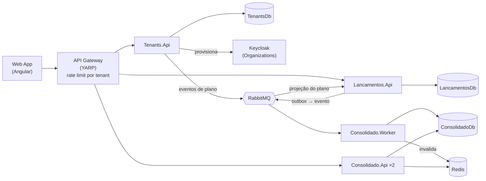

# Verx — Desafio Arquiteto de Software: Fluxo de Caixa Diário (SaaS)

Plataforma **SaaS multi-tenant** para comerciantes controlarem o fluxo de caixa diário: **lançamentos** (débitos e créditos) e **relatório de saldo diário consolidado**. Cada empresa é um tenant, com seus usuários, seu plano e seus dados isolados.

> 🚧 Em construção. Este README é atualizado a cada entrega. Veja o andamento em [Roadmap](#roadmap).

## Sumário
- [Visão geral](#visão-geral)
- [Arquitetura](#arquitetura)
- [Stack](#stack)
- [Estrutura do repositório](#estrutura-do-repositório)
- [Como executar localmente](#como-executar-localmente)
- [API de Tenants (Plataforma)](#api-de-tenants-plataforma)
- [API de Lançamentos](#api-de-lançamentos)
- [API de Consolidado](#api-de-consolidado)
- [Segurança](#segurança)
- [Testes](#testes)
- [Documentação](#documentação)
- [Roadmap](#roadmap)
- [Contribuição](#contribuição)

## Visão geral

| Serviço | Contexto | Responsabilidade |
|---|---|---|
| **Tenants** | Plataforma | Onboarding de empresas (autoatendimento), planos (Free/Pro), quotas e usuários do tenant. |
| **Lançamentos** | Core | Registra créditos, débitos e estornos do tenant, respeitando a quota do plano. **Deve permanecer disponível mesmo se o Consolidado cair.** |
| **Consolidado** | Suporte | Mantém e expõe o saldo diário consolidado por tenant. **Suporta picos de 50 req/s com no máximo 5% de perda.** |

| Papel | Pode |
|---|---|
| `admin` | Cadastrar a empresa, gerenciar usuários e plano, registrar e **estornar** lançamentos, consultar o consolidado |
| `operador` | Registrar lançamentos e consultar o consolidado |

## Arquitetura

Microsserviços por bounded context com comunicação assíncrona orientada a eventos (RabbitMQ + Transactional Outbox), Clean Architecture + CQRS com Web APIs em controllers, multi-tenancy com isolamento por `TenantId`, cache Redis na leitura do consolidado e API Gateway (YARP) com rate limiting por tenant/plano.



| Visão | Documento |
|---|---|
| Domínio | [Modelo de domínio](docs/dominio.md) |
| C4 — Contexto | [Nível 1](docs/architecture/c4-1-contexto.md) |
| C4 — Containers | [Nível 2](docs/architecture/c4-2-containers.md) |
| C4 — Componentes | [Nível 3](docs/architecture/c4-3-componentes.md) |
| Fluxos e cenários de falha | [Diagramas de sequência](docs/architecture/fluxos.md) |
| Implantação | [Local e produção](docs/architecture/deployment.md) |
| Requisitos não funcionais | [SLOs e metas](docs/requisitos-nao-funcionais.md) |
| Decisões arquiteturais | [ADRs](docs/adr/README.md) |

## Stack

| Camada | Tecnologia |
|---|---|
| Backend | .NET 10 (C#), ASP.NET Core Web API (controllers), EF Core |
| Frontend | Angular |
| Banco de dados | SQL Server 2022 (Docker), database-per-service, discriminador `TenantId` |
| Mensageria | RabbitMQ (MassTransit) |
| Cache | Redis |
| Identidade | Keycloak (OIDC / JWT, Organizations) |
| Gateway | YARP |
| Testes | xUnit, NSubstitute, Shouldly, Testcontainers, NetArchTest, k6 |
| Infra local | Docker Compose |

## Estrutura do repositório

O repositório tem três blocos: **app** (frontend), **api** (backend) e **tests**.

```
├─ src/
│  ├─ app/                         ← Frontend Angular (SPA)
│  └─ api/                         ← Backend .NET 10 (C#)
│     ├─ BuildingBlocks/           ← código compartilhado entre os serviços
│     │  ├─ FluxoCaixa.SharedKernel          (Result, Entity, abstrações CQRS e de tenant — sem dependências)
│     │  ├─ FluxoCaixa.Contracts             (eventos de integração versionados)
│     │  ├─ FluxoCaixa.Application.Common    (dispatcher CQRS, decorators de validação/log)
│     │  └─ FluxoCaixa.Infrastructure.Common (padrões de Web API, EF Core multi-tenant)
│     ├─ Gateway/FluxoCaixa.Gateway          (YARP)
│     ├─ Tenants/                  ← serviço (contexto Plataforma)
│     ├─ Lancamentos/              ← serviço (contexto Lançamentos)
│     └─ Consolidado/              ← serviço (contexto Consolidado) + Worker
├─ tests/                          ← testes unitários, de arquitetura, de integração e de carga (k6 em tests/stress)
├─ docs/                           ← C4, ADRs, domínio, requisitos não funcionais
└─ FluxoCaixa.slnx                 ← solução .NET
```

**Por que cada serviço tem vários projetos?** Cada serviço segue a **Clean Architecture** ([ADR-0003](docs/adr/0003-clean-architecture-cqrs.md)), com uma camada por projeto `.csproj`, e as dependências apontam só para dentro:

```
<Serviço>.Api  ──►  <Serviço>.Infrastructure  ──►  <Serviço>.Application  ──►  <Serviço>.Domain
(controllers,       (EF Core, RabbitMQ,           (casos de uso,              (regras de negócio,
 executável)         Redis, Keycloak)              CQRS, portas)               sem frameworks)
```

Separar as camadas em projetos faz o **compilador** impedir dependências proibidas (ex.: o `Domain` não consegue usar o EF Core porque não tem essa referência). Os testes em `tests/Architecture.Tests` completam essas regras.

## Como executar localmente

### Pré-requisitos
- [Docker Desktop](https://www.docker.com/products/docker-desktop/) (com WSL2 no Windows) — **obrigatório**
- [.NET SDK 10.0.400+](https://dotnet.microsoft.com/download) — opcional: build e testes também rodam em container (ver [Testes](#testes))
- [Node.js LTS](https://nodejs.org/) (24+) — opcional: só para desenvolver o frontend fora do container

### 1. Subir a infraestrutura

```bash
cd deploy
cp .env.example .env          # ajuste as senhas se quiser; o .env não é versionado
docker compose up -d
docker compose ps             # aguarde todos ficarem "healthy" (~1 min)
```

| Componente | Endereço | Acesso |
|---|---|---|
| Keycloak (console) | http://localhost:8081 | `KEYCLOAK_ADMIN` / `KEYCLOAK_ADMIN_PASSWORD` do `.env` |
| RabbitMQ (management) | http://localhost:15672 | `RABBITMQ_USER` / `RABBITMQ_PASSWORD` do `.env` |
| Aspire Dashboard (observabilidade) | http://localhost:18888 | anônimo (somente local) |
| SQL Server | `localhost,1433` | `sa` / `MSSQL_SA_PASSWORD` do `.env` |
| Redis | `localhost:6379` | — |

### 2. Usuários de demonstração

O realm `fluxo-caixa` é importado automaticamente com dois tenants (Organizations do Keycloak). Senha de todos: **`Senha@123`** (somente ambiente local).

| Tenant | Plano | `tenant_id` | Usuário `admin` | Usuário `operador` |
|---|---|---|---|---|
| Padaria Demo | Free | `0192f79e-0001-7000-8000-000000000001` | `admin.padaria` | `operador.padaria` |
| Mercado Demo | Pro | `0192f79e-0002-7000-8000-000000000002` | `admin.mercado` | `operador.mercado` |

Obter um token para testar as APIs (client `fluxo-caixa-testes`, habilitado só localmente):

```bash
curl -s -X POST http://localhost:8081/realms/fluxo-caixa/protocol/openid-connect/token \
  -d grant_type=password -d client_id=fluxo-caixa-testes \
  -d username=admin.mercado -d 'password=Senha@123'
```

O access token traz as claims `tenant_id`, `plano`, `roles` (`admin` inclui `operador`) e a audiência `fluxo-caixa-api`.

### 3. Serviços da aplicação

O mesmo `docker compose up -d` (a partir de `deploy/`) compila as imagens e sobe os serviços. Para reconstruir após alterar o código: `docker compose up -d --build`.

| Serviço | Endereço | Documentação da API |
|---|---|---|
| **Aplicação web (SPA)** | **http://localhost:4200** | — |
| **API Gateway (entrada das APIs)** | **http://localhost:8080** | — |
| Tenants.Api (depuração) | http://localhost:5301 | http://localhost:5301/scalar |
| Lancamentos.Api (depuração) | http://localhost:5101 | http://localhost:5101/scalar |
| Consolidado.Api, réplicas 1 e 2 (depuração) | http://localhost:5201 · http://localhost:5202 | http://localhost:5201/scalar |
| Consolidado.Worker | — (interno) | — |

Cada API expõe `/health/live`, `/health/ready` e, em desenvolvimento, o OpenAPI em `/openapi/v1.json` e a UI **Scalar** em `/scalar`. As migrations são aplicadas na inicialização.

Para executar fora do container (com a infraestrutura do passo 1 no ar): `dotnet run --project src/api/Lancamentos/Lancamentos.Api`.

> **Use o gateway (8080)**: ele valida o token, aplica o rate limit do plano e balanceia as réplicas do Consolidado. As portas diretas dos serviços existem apenas para depuração. A SPA chama as APIs sempre pelo gateway.

## Aplicação web

Abra **http://localhost:4200**:

1. **Cadastrar minha empresa**: razão social, CNPJ, plano e o administrador. Ou use um usuário de demonstração.
2. **Entrar**: login no Keycloak (Authorization Code + PKCE). Nenhuma senha passa pela SPA.
3. **Lançamentos**:
   - registre créditos e débitos e consulte os lançamentos de um dia;
   - o **estorno** aparece só para admin;
   - o reenvio após uma falha reutiliza a mesma `Idempotency-Key`, então não há lançamento duplicado.
4. **Consolidado**:
   - mostra o saldo do dia, os totais do período (até 93 dias), o gráfico de créditos, débitos e saldo, e a tabela dos dias com movimento;
   - com o serviço fora do ar, um aviso informa que os lançamentos continuam sendo aceitos.
5. **Minha empresa** (admin): dados da empresa, troca de plano (o token é renovado com o novo plano) e usuários, respeitando o limite do plano.

A imagem da SPA é única para todos os ambientes: o `config.json` (URL do gateway e do Keycloak) e a Content-Security-Policy são gerados na inicialização a partir de `API_URL`, `OIDC_AUTHORITY` e `OIDC_CLIENT_ID` ([ADR-0018](docs/adr/0018-frontend-angular-spa.md)).

Para desenvolver o frontend com recarga automática (com a stack no ar):

```bash
docker compose -f deploy/docker-compose.yml stop web   # libera a porta 4200
cd src/app/fluxo-caixa-web
npm ci
npx ng serve                                           # http://localhost:4200
```

## API de Tenants (Plataforma)

Cadastro da empresa em autoatendimento, planos e usuários. O cadastro cria a **Organization** e o usuário **admin** no Keycloak; o admin já pode fazer login e usar a plataforma.

| Método e rota | Acesso | Respostas |
|---|---|---|
| `GET /api/v1/planos` | público | 200 (Free e Pro, com quotas e rate limit) |
| `POST /api/v1/tenants` | público | 201 `Ativo`; 400; 409 (CNPJ ou e-mail já usados); **503** se o Keycloak estiver fora — reenvie o mesmo cadastro para concluir |
| `GET /api/v1/tenants/atual` | operador | 200 |
| `PUT /api/v1/tenants/atual/plano` | admin | 200; 409 (mesmo plano); 422 (usuários acima do limite do novo plano) |
| `GET /api/v1/tenants/atual/usuarios` | admin | 200 |
| `POST /api/v1/tenants/atual/usuarios` | admin | 201; 409 (e-mail em uso); 422 (limite de usuários do plano) |

```bash
curl -X POST http://localhost:8080/api/v1/tenants -H "Content-Type: application/json" -d '{
  "razaoSocial": "Acougue Boa Carne Ltda", "nomeFantasia": "Acougue Boa Carne",
  "cnpj": "11.222.333/0001-81", "plano": "free",
  "administrador": { "nome": "Ana Souza", "email": "ana@acougue.dev", "senha": "Senha@123" }
}'
```

A troca de plano chega ao Lançamentos pelo evento `PlanoDoTenantAlterado` (nova quota em segundos) e ao token no próximo login/refresh (claim `plano`).

## API de Lançamentos

Todas as rotas exigem `Authorization: Bearer <token>`; o tenant vem do token. Erros seguem ProblemDetails (RFC 9457) com o código estável em `codigo`.

| Método e rota | Papel | Respostas |
|---|---|---|
| `POST /api/v1/lancamentos` (header opcional `Idempotency-Key`) | operador | 201, 400 (validação), 422 (quota do plano) |
| `GET /api/v1/lancamentos/{id}` | operador | 200, 404 (inexistente ou de outro tenant) |
| `GET /api/v1/lancamentos?data=AAAA-MM-DD&pagina=1&tamanhoPagina=50` | operador | 200 (paginado) |
| `POST /api/v1/lancamentos/{id}/estorno` | admin | 201, 403, 404, 409 (já estornado) |

```bash
TOKEN=$(curl -s -X POST http://localhost:8081/realms/fluxo-caixa/protocol/openid-connect/token \
  -d grant_type=password -d client_id=fluxo-caixa-testes \
  -d username=operador.mercado -d 'password=Senha@123' | jq -r .access_token)

curl -X POST http://localhost:8080/api/v1/lancamentos \
  -H "Authorization: Bearer $TOKEN" -H "Content-Type: application/json" \
  -H "Idempotency-Key: $(uuidgen)" \
  -d '{"tipo":"Credito","valor":1500.50,"dataCompetencia":"2026-09-22","descricao":"Vendas do dia"}'
```

Cada lançamento (e cada estorno) publica o evento `LancamentoRegistrado` no RabbitMQ via Transactional Outbox: o registro **não depende** do broker nem do Consolidado (RNF-01).

## API de Consolidado

Saldo diário consolidado do tenant, atualizado pelo `Consolidado.Worker` a partir dos eventos (consistência eventual; em regime local, 250–350 ms após o lançamento). Leitura com cache Redis; com o Redis fora, responde pelo banco.

| Método e rota | Papel | Respostas |
|---|---|---|
| `GET /api/v1/consolidado/{data}` | operador | 200 (dia sem movimento retorna zeros) |
| `GET /api/v1/consolidado?inicio=AAAA-MM-DD&fim=AAAA-MM-DD` | operador | 200 com todos os dias e os totais; 400 se o período for inválido ou maior que 93 dias |

```bash
curl http://localhost:8080/api/v1/consolidado/2026-09-22 -H "Authorization: Bearer $TOKEN"
# {"data":"2026-09-22","totalCreditos":1000.00,"totalDebitos":250.00,"saldo":750.00,"quantidadeLancamentos":2}
```

**Demonstração do RNF-01:** `docker compose stop consolidado-api-1 consolidado-api-2 consolidado-worker` → os lançamentos continuam retornando 201 → `docker compose start consolidado-worker consolidado-api-1 consolidado-api-2` → o saldo converge com todos os lançamentos feitos durante a queda.

## Segurança

- **Entrada única** pelo gateway: JWT do Keycloak validado no gateway e em cada serviço; rotas públicas só para cadastro e catálogo de planos.
- **Rate limiting por tenant**, conforme o plano (Free 20 req/s, Pro 100 req/s): um tenant que excede recebe 429 sem afetar os demais; rotas públicas limitadas por IP.
- **Isolamento entre tenants** em várias camadas (token, filtro global do EF Core, cache, 404 para dados de outro tenant), coberto por testes.
- Headers de segurança, CORS restrito à SPA, limite de corpo, segredos fora do repositório.

Ameaças, controles, evidências e riscos residuais: [docs/seguranca.md](docs/seguranca.md).

## Testes

```bash
dotnet test                    # usa o Microsoft Testing Platform (global.json)
dotnet test -- --coverage      # com cobertura
```

Sem o SDK .NET instalado — ou se o Windows bloquear DLLs recém-compiladas (erro `0x800711C7`, *Smart App Control*) — rode tudo em container:

```powershell
./scripts/test.ps1                                   # Windows
./scripts/test.sh                                    # Linux / macOS
./scripts/test.ps1 --project tests/Architecture.Tests
```

| Projeto de teste | Cobre |
|---|---|
| `Architecture.Tests` | Regras de dependência da Clean Architecture, isolamento entre contextos, `ITenantEntity` nas entidades |
| `FluxoCaixa.SharedKernel.UnitTests` | `Result`, `Error`, `Entity`, `AggregateRoot`, `ValueObject`, `TenantContext` |
| `FluxoCaixa.Application.Common.UnitTests` | Dispatcher CQRS e decorators (validação, log) |
| `FluxoCaixa.Infrastructure.Common.UnitTests` | Isolamento de tenant no EF Core (filtro global, gravação) e middleware de tenant |
| `FluxoCaixa.Contracts.UnitTests` | Contratos JSON dos eventos de integração |
| `Lancamentos.Domain.UnitTests` | `Dinheiro`, agregado `Lancamento` (RN-01 a RN-06, fuso de São Paulo), projeção `TenantPlano` |
| `Lancamentos.Application.UnitTests` | Registro (quota RN-09, idempotência RN-08), estorno (RN-10), consultas e validadores |
| `Consolidado.Domain.UnitTests` | `SaldoDiario` (aplicação comutativa, estorno), inbox |
| `Consolidado.Application.UnitTests` | Aplicação idempotente de eventos, cache-aside e TTLs, período com dias preenchidos |
| `Consolidado.IntegrationTests` | Evento → worker → consulta com SQL Server, RabbitMQ e Redis reais: duplicidade, isolamento, cache e **Redis fora do ar** |
| `Tenants.Domain.UnitTests` | CNPJ, catálogo de planos, agregado `Tenant` (ciclo de vida, RP-05) |
| `Tenants.Application.UnitTests` | Onboarding como saga (compensação, retomada, 503), plano, usuários, expiração |
| `Tenants.IntegrationTests` | Onboarding e gestão com **Keycloak real**: login do admin criado, compensação, Keycloak fora do ar |
| `FluxoCaixa.Gateway.Tests` | Roteamento, JWT, rotas públicas, rate limit por tenant/plano e por IP, balanceamento, failover com retentativa, headers de segurança, CORS |
| `Lancamentos.IntegrationTests` | API de ponta a ponta com SQL Server e RabbitMQ reais (Testcontainers): outbox, isolamento entre tenants, quota via evento e **registro com o RabbitMQ fora do ar** |

**Frontend** (Vitest):

```bash
cd src/app/fluxo-caixa-web && npm ci && npx ng test --watch=false
```

**Smoke E2E** (Playwright em container, contra a stack do compose no ar). O teste cadastra uma empresa nova, faz login no Keycloak, registra um crédito e um débito e espera o saldo consolidado convergir:

```powershell
./scripts/test-e2e.ps1                               # Windows
./scripts/test-e2e.sh                                # Linux / macOS
```

| Frontend | Cobre |
|---|---|
| Unitários (Vitest) | Validadores (CNPJ, senha, datas), conversão de erros ProblemDetails/429/503, clientes das APIs (`Idempotency-Key`), guards por papel, cadastro pendente (503), idempotência no reenvio, banner de consolidado indisponível |
| E2E (Playwright) | Cadastro → login OIDC → lançamentos → saldo consolidado, com a CSP de produção ativa |

**Carga e caos** (k6 em container, contra a stack do compose no ar):

```powershell
./scripts/carga.ps1 consolidado-50rps     # 50 req/s por 5 min + pico de 100 req/s (RNF-02)
./scripts/carga.ps1 lancamentos-carga     # escrita concorrente, idempotência e convergência do saldo
./scripts/carga.ps1 noisy-neighbor        # tenant Free acima do limite × tenant Pro
./scripts/caos.ps1 consolidado            # Consolidado fora durante a escrita (RNF-01); também: broker, replica
```

| Resultado (máquina local) | |
|---|---|
| Consolidado a 50 req/s por 5 min | **0% de erro**, p95 6,8 ms, p99 9,4 ms; pico de 100 req/s com 0% de erro |
| Lançamentos a 50 req/s | 0% de erro, p95 33 ms; saldo consolidado igual à soma **0,57 s** após a carga |
| Consolidado, RabbitMQ ou uma réplica fora do ar | Lançamentos com **0% de erro**; saldo converge; com uma réplica fora, 0,49% de perda nas consultas |
| Vizinho barulhento | Free recebe 429 no limite do plano; Pro sem degradação |

Os testes de carga encontraram e ajudaram a corrigir dois defeitos (detalhes em [docs/testes.md](docs/testes.md#resultados-dos-testes-de-carga-fase-8)).

Estratégia completa: [docs/testes.md](docs/testes.md).

## Documentação
Índice completo: [`docs/README.md`](docs/README.md).

## Roadmap

- [x] Fase 0 — Setup do repositório
- [x] Fase 1 — Diagramas C4 e definição de arquitetura
- [x] Fase 2 — ADRs
- [x] Fase 2.5 — Revisão SaaS multi-tenant (ADRs 0015–0017, domínio, C4, fluxos, NFR)
- [x] Fase 3 — Estrutura da solução (inclui building blocks de multi-tenancy)
- [x] Fase 4 — Serviço de Lançamentos (controllers, quota, isolamento)
- [x] Fase 5 — Serviço de Consolidado
- [x] Fase 5.5 — Serviço de Tenants (onboarding, planos, usuários)
- [x] Fase 6 — Gateway e segurança (rate limit por tenant/plano)
- [x] Fase 7 — Frontend Angular (cadastro da empresa, lançamentos, consolidado, gestão de plano e usuários)
- [x] Fase 8 — Testes de carga e resiliência com k6 (inclui noisy neighbor e caos)
- [ ] Fase 9 — Observabilidade e CI
- [ ] Fase 10 — Documentação final

## Contribuição
Fluxo de branches e padrão de commits: veja [CONTRIBUTING.md](CONTRIBUTING.md).
