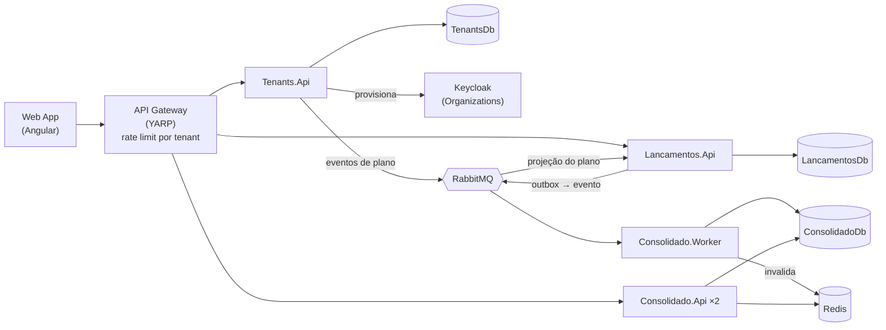

# Verx — Desafio Arquiteto de Software: Fluxo de Caixa Diário (SaaS)

Plataforma **SaaS multi-tenant** para comerciantes controlarem o fluxo de caixa diário: **lançamentos** (débitos e créditos) e **relatório de saldo diário consolidado**. Cada empresa é um tenant, com seus usuários, seu plano e seus dados isolados.

> 🚧 Em construção. Este README é atualizado a cada entrega. Veja o andamento em [Roadmap](#roadmap).

## Sumário
- [Visão geral](#visão-geral)
- [Arquitetura](#arquitetura)
- [Stack](#stack)
- [Estrutura do repositório](#estrutura-do-repositório)
- [Como executar localmente](#como-executar-localmente)
- [Testes](#testes)
- [Documentação](#documentação)
- [Roadmap](#roadmap)
- [Contribuição](#contribuição)

## Visão geral

| Serviço | Contexto | Responsabilidade |
|---|---|---|
| **Tenants** | Plataforma | Onboarding de empresas (autoatendimento), planos (Free/Pro), quotas e usuários do tenant. |
| **Lançamentos** | Core | Registra créditos, débitos e estornos do tenant, respeitando a quota do plano. **Deve permanecer disponível mesmo se o Consolidado cair.** |
| **Consolidado** | Suporte | Mantém e expõe o saldo diário consolidado por tenant. **Suporta picos de 50 req/s com no máximo 5% de perda.** |

| Papel | Pode |
|---|---|
| `admin` | Cadastrar a empresa, gerenciar usuários e plano, registrar e **estornar** lançamentos, consultar o consolidado |
| `operador` | Registrar lançamentos e consultar o consolidado |

## Arquitetura

Microsserviços por bounded context com comunicação assíncrona orientada a eventos (RabbitMQ + Transactional Outbox), Clean Architecture + CQRS com Web APIs em controllers, multi-tenancy com isolamento por `TenantId`, cache Redis na leitura do consolidado e API Gateway (YARP) com rate limiting por tenant/plano.



| Visão | Documento |
|---|---|
| Domínio | [Modelo de domínio](docs/dominio.md) |
| C4 — Contexto | [Nível 1](docs/architecture/c4-1-contexto.md) |
| C4 — Containers | [Nível 2](docs/architecture/c4-2-containers.md) |
| C4 — Componentes | [Nível 3](docs/architecture/c4-3-componentes.md) |
| Fluxos e cenários de falha | [Diagramas de sequência](docs/architecture/fluxos.md) |
| Implantação | [Local e produção](docs/architecture/deployment.md) |
| Requisitos não funcionais | [SLOs e metas](docs/requisitos-nao-funcionais.md) |
| Decisões arquiteturais | [ADRs](docs/adr/README.md) |

## Stack

| Camada | Tecnologia |
|---|---|
| Backend | .NET 10 (C#), ASP.NET Core Web API (controllers), EF Core |
| Frontend | Angular |
| Banco de dados | SQL Server 2022 (Docker), database-per-service, discriminador `TenantId` |
| Mensageria | RabbitMQ (MassTransit) |
| Cache | Redis |
| Identidade | Keycloak (OIDC / JWT, Organizations) |
| Gateway | YARP |
| Testes | xUnit, NSubstitute, Shouldly, Testcontainers, NetArchTest, k6 |
| Infra local | Docker Compose |

## Estrutura do repositório

O repositório tem três blocos: **app** (frontend), **api** (backend) e **tests**.

```
├─ src/
│  ├─ app/                         ← Frontend Angular (SPA)
│  └─ api/                         ← Backend .NET 10 (C#)
│     ├─ BuildingBlocks/           ← código compartilhado entre os serviços
│     │  ├─ FluxoCaixa.SharedKernel          (Result, Entity, abstrações CQRS e de tenant — sem dependências)
│     │  ├─ FluxoCaixa.Contracts             (eventos de integração versionados)
│     │  ├─ FluxoCaixa.Application.Common    (dispatcher CQRS, decorators de validação/log)
│     │  └─ FluxoCaixa.Infrastructure.Common (padrões de Web API, EF Core multi-tenant)
│     ├─ Gateway/FluxoCaixa.Gateway          (YARP)
│     ├─ Tenants/                  ← serviço (contexto Plataforma)
│     ├─ Lancamentos/              ← serviço (contexto Lançamentos)
│     └─ Consolidado/              ← serviço (contexto Consolidado) + Worker
├─ tests/                          ← testes unitários, de arquitetura e de integração (k6 em tests/stress)
├─ docs/                           ← C4, ADRs, domínio, requisitos não funcionais
└─ FluxoCaixa.slnx                 ← solução .NET
```

**Por que cada serviço tem vários projetos?** Cada serviço segue a **Clean Architecture** ([ADR-0003](docs/adr/0003-clean-architecture-cqrs.md)), com uma camada por projeto `.csproj`, e as dependências apontam só para dentro:

```
<Serviço>.Api  ──►  <Serviço>.Infrastructure  ──►  <Serviço>.Application  ──►  <Serviço>.Domain
(controllers,       (EF Core, RabbitMQ,           (casos de uso,              (regras de negócio,
 executável)         Redis, Keycloak)              CQRS, portas)               sem frameworks)
```

Separar as camadas em projetos faz o **compilador** impedir dependências proibidas (ex.: o `Domain` não consegue usar o EF Core porque não tem essa referência). Os testes em `tests/Architecture.Tests` completam essas regras.

## Como executar localmente

### Pré-requisitos
- [.NET SDK 10.0.400+](https://dotnet.microsoft.com/download)
- [Node.js LTS](https://nodejs.org/) (24+)
- [Docker Desktop](https://www.docker.com/products/docker-desktop/)

### Passos
_Em breve._

## Testes
_Em breve._

## Documentação
Índice completo: [`docs/README.md`](docs/README.md).

## Roadmap

- [x] Fase 0 — Setup do repositório
- [x] Fase 1 — Diagramas C4 e definição de arquitetura
- [x] Fase 2 — ADRs
- [x] Fase 2.5 — Revisão SaaS multi-tenant (ADRs 0015–0017, domínio, C4, fluxos, NFR)
- [ ] Fase 3 — Estrutura da solução (inclui building blocks de multi-tenancy)
- [ ] Fase 4 — Serviço de Lançamentos (controllers, quota, isolamento)
- [ ] Fase 5 — Serviço de Consolidado
- [ ] Fase 5.5 — Serviço de Tenants (onboarding, planos, usuários)
- [ ] Fase 6 — Gateway e segurança (rate limit por tenant/plano)
- [ ] Fase 7 — Frontend Angular (inclui cadastro da empresa e gestão de usuários)
- [ ] Fase 8 — Testes de stress e resiliência (inclui noisy neighbor)
- [ ] Fase 9 — Observabilidade e CI
- [ ] Fase 10 — Documentação final

## Contribuição
Fluxo de branches e padrão de commits: veja [CONTRIBUTING.md](CONTRIBUTING.md).
