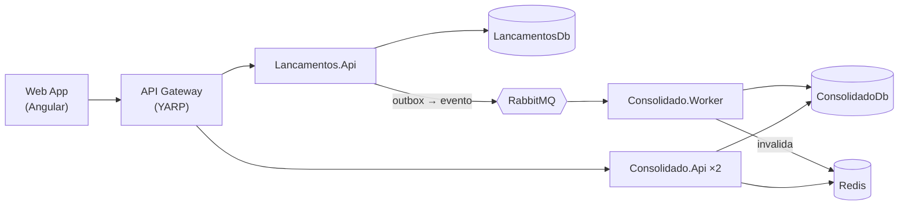

# Verx — Desafio Arquiteto de Software: Fluxo de Caixa Diário

Solução para um comerciante controlar o fluxo de caixa diário: **lançamentos** (débitos e créditos) e **relatório de saldo diário consolidado**.

> 🚧 Em construção. Este README é atualizado a cada entrega. Veja o andamento em [Roadmap](#roadmap).

## Sumário
- [Visão geral](#visão-geral)
- [Arquitetura](#arquitetura)
- [Stack](#stack)
- [Como executar localmente](#como-executar-localmente)
- [Testes](#testes)
- [Documentação](#documentação)
- [Roadmap](#roadmap)
- [Contribuição](#contribuição)

## Visão geral

| Serviço | Responsabilidade |
|---|---|
| **Lançamentos** | Registra créditos e débitos (e estornos). Deve permanecer disponível mesmo se o Consolidado cair. |
| **Consolidado** | Mantém e expõe o saldo diário consolidado. Suporta picos de 50 req/s com no máximo 5% de perda. |

## Arquitetura

Microsserviços por bounded context com comunicação assíncrona orientada a eventos (RabbitMQ + Transactional Outbox), Clean Architecture + CQRS em cada serviço, cache Redis na leitura do consolidado e API Gateway (YARP).

| Visão | Documento |
|---|---|
| Domínio | [Modelo de domínio](docs/dominio.md) |
| C4 — Contexto | [Nível 1](docs/architecture/c4-1-contexto.md) |
| C4 — Containers | [Nível 2](docs/architecture/c4-2-containers.md) |
| C4 — Componentes | [Nível 3](docs/architecture/c4-3-componentes.md) |
| Fluxos e cenários de falha | [Diagramas de sequência](docs/architecture/fluxos.md) |
| Implantação | [Local e produção](docs/architecture/deployment.md) |
| Requisitos não funcionais | [SLOs e metas](docs/requisitos-nao-funcionais.md) |
| Decisões arquiteturais | [ADRs](docs/adr/README.md) |

## Stack

| Camada | Tecnologia |
|---|---|
| Backend | .NET 10 (C#), ASP.NET Core Minimal APIs, EF Core |
| Frontend | Angular |
| Banco de dados | SQL Server 2022 (Docker) |
| Mensageria | RabbitMQ |
| Cache | Redis |
| Identidade | Keycloak (OIDC / JWT) |
| Gateway | YARP |
| Testes | xUnit, NSubstitute, Shouldly, Testcontainers, NetArchTest, k6 |
| Infra local | Docker Compose |

## Como executar localmente

### Pré-requisitos
- [.NET SDK 10.0.400+](https://dotnet.microsoft.com/download)
- [Node.js LTS](https://nodejs.org/) (24+)
- [Docker Desktop](https://www.docker.com/products/docker-desktop/)

### Passos
_Em breve._

## Testes
_Em breve._

## Documentação
Índice completo: [`docs/README.md`](docs/README.md).

## Roadmap

- [x] Fase 0 — Setup do repositório
- [x] Fase 1 — Diagramas C4 e definição de arquitetura
- [x] Fase 2 — ADRs
- [ ] Fase 3 — Estrutura da solução
- [ ] Fase 4 — Serviço de Lançamentos
- [ ] Fase 5 — Serviço de Consolidado
- [ ] Fase 6 — Gateway e segurança
- [ ] Fase 7 — Frontend Angular
- [ ] Fase 8 — Testes de stress e resiliência
- [ ] Fase 9 — Observabilidade e CI
- [ ] Fase 10 — Documentação final

## Contribuição
Fluxo de branches e padrão de commits: veja [CONTRIBUTING.md](CONTRIBUTING.md).
