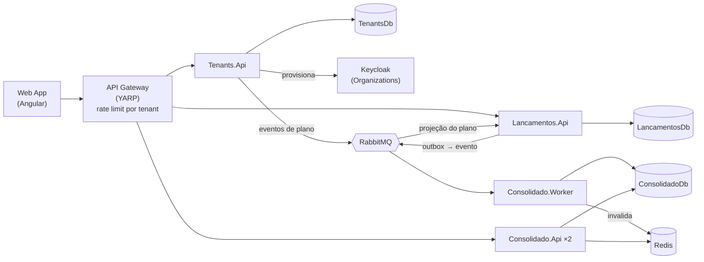

# Verx — Desafio Arquiteto de Software: Fluxo de Caixa Diário (SaaS)

Plataforma **SaaS multi-tenant** para comerciantes controlarem o fluxo de caixa diário: **lançamentos** (débitos e créditos) e **relatório de saldo diário consolidado**. Cada empresa é um tenant, com seus usuários, seu plano e seus dados isolados.

> 🚧 Em construção. Este README é atualizado a cada entrega. Veja o andamento em [Roadmap](#roadmap).

## Sumário
- [Visão geral](#visão-geral)
- [Arquitetura](#arquitetura)
- [Stack](#stack)
- [Estrutura do repositório](#estrutura-do-repositório)
- [Como executar localmente](#como-executar-localmente)
- [API de Lançamentos](#api-de-lançamentos)
- [Testes](#testes)
- [Documentação](#documentação)
- [Roadmap](#roadmap)
- [Contribuição](#contribuição)

## Visão geral

| Serviço | Contexto | Responsabilidade |
|---|---|---|
| **Tenants** | Plataforma | Onboarding de empresas (autoatendimento), planos (Free/Pro), quotas e usuários do tenant. |
| **Lançamentos** | Core | Registra créditos, débitos e estornos do tenant, respeitando a quota do plano. **Deve permanecer disponível mesmo se o Consolidado cair.** |
| **Consolidado** | Suporte | Mantém e expõe o saldo diário consolidado por tenant. **Suporta picos de 50 req/s com no máximo 5% de perda.** |

| Papel | Pode |
|---|---|
| `admin` | Cadastrar a empresa, gerenciar usuários e plano, registrar e **estornar** lançamentos, consultar o consolidado |
| `operador` | Registrar lançamentos e consultar o consolidado |

## Arquitetura

Microsserviços por bounded context com comunicação assíncrona orientada a eventos (RabbitMQ + Transactional Outbox), Clean Architecture + CQRS com Web APIs em controllers, multi-tenancy com isolamento por `TenantId`, cache Redis na leitura do consolidado e API Gateway (YARP) com rate limiting por tenant/plano.



| Visão | Documento |
|---|---|
| Domínio | [Modelo de domínio](docs/dominio.md) |
| C4 — Contexto | [Nível 1](docs/architecture/c4-1-contexto.md) |
| C4 — Containers | [Nível 2](docs/architecture/c4-2-containers.md) |
| C4 — Componentes | [Nível 3](docs/architecture/c4-3-componentes.md) |
| Fluxos e cenários de falha | [Diagramas de sequência](docs/architecture/fluxos.md) |
| Implantação | [Local e produção](docs/architecture/deployment.md) |
| Requisitos não funcionais | [SLOs e metas](docs/requisitos-nao-funcionais.md) |
| Decisões arquiteturais | [ADRs](docs/adr/README.md) |

## Stack

| Camada | Tecnologia |
|---|---|
| Backend | .NET 10 (C#), ASP.NET Core Web API (controllers), EF Core |
| Frontend | Angular |
| Banco de dados | SQL Server 2022 (Docker), database-per-service, discriminador `TenantId` |
| Mensageria | RabbitMQ (MassTransit) |
| Cache | Redis |
| Identidade | Keycloak (OIDC / JWT, Organizations) |
| Gateway | YARP |
| Testes | xUnit, NSubstitute, Shouldly, Testcontainers, NetArchTest, k6 |
| Infra local | Docker Compose |

## Estrutura do repositório

O repositório tem três blocos: **app** (frontend), **api** (backend) e **tests**.

```
├─ src/
│  ├─ app/                         ← Frontend Angular (SPA)
│  └─ api/                         ← Backend .NET 10 (C#)
│     ├─ BuildingBlocks/           ← código compartilhado entre os serviços
│     │  ├─ FluxoCaixa.SharedKernel          (Result, Entity, abstrações CQRS e de tenant — sem dependências)
│     │  ├─ FluxoCaixa.Contracts             (eventos de integração versionados)
│     │  ├─ FluxoCaixa.Application.Common    (dispatcher CQRS, decorators de validação/log)
│     │  └─ FluxoCaixa.Infrastructure.Common (padrões de Web API, EF Core multi-tenant)
│     ├─ Gateway/FluxoCaixa.Gateway          (YARP)
│     ├─ Tenants/                  ← serviço (contexto Plataforma)
│     ├─ Lancamentos/              ← serviço (contexto Lançamentos)
│     └─ Consolidado/              ← serviço (contexto Consolidado) + Worker
├─ tests/                          ← testes unitários, de arquitetura e de integração (k6 em tests/stress)
├─ docs/                           ← C4, ADRs, domínio, requisitos não funcionais
└─ FluxoCaixa.slnx                 ← solução .NET
```

**Por que cada serviço tem vários projetos?** Cada serviço segue a **Clean Architecture** ([ADR-0003](docs/adr/0003-clean-architecture-cqrs.md)), com uma camada por projeto `.csproj`, e as dependências apontam só para dentro:

```
<Serviço>.Api  ──►  <Serviço>.Infrastructure  ──►  <Serviço>.Application  ──►  <Serviço>.Domain
(controllers,       (EF Core, RabbitMQ,           (casos de uso,              (regras de negócio,
 executável)         Redis, Keycloak)              CQRS, portas)               sem frameworks)
```

Separar as camadas em projetos faz o **compilador** impedir dependências proibidas (ex.: o `Domain` não consegue usar o EF Core porque não tem essa referência). Os testes em `tests/Architecture.Tests` completam essas regras.

## Como executar localmente

### Pré-requisitos
- [Docker Desktop](https://www.docker.com/products/docker-desktop/) (com WSL2 no Windows) — **obrigatório**
- [.NET SDK 10.0.400+](https://dotnet.microsoft.com/download) — opcional: build e testes também rodam em container (ver [Testes](#testes))
- [Node.js LTS](https://nodejs.org/) (24+) — para o frontend (Fase 7)

### 1. Subir a infraestrutura

```bash
cd deploy
cp .env.example .env          # ajuste as senhas se quiser; o .env não é versionado
docker compose up -d
docker compose ps             # aguarde todos ficarem "healthy" (~1 min)
```

| Componente | Endereço | Acesso |
|---|---|---|
| Keycloak (console) | http://localhost:8081 | `KEYCLOAK_ADMIN` / `KEYCLOAK_ADMIN_PASSWORD` do `.env` |
| RabbitMQ (management) | http://localhost:15672 | `RABBITMQ_USER` / `RABBITMQ_PASSWORD` do `.env` |
| Aspire Dashboard (observabilidade) | http://localhost:18888 | anônimo (somente local) |
| SQL Server | `localhost,1433` | `sa` / `MSSQL_SA_PASSWORD` do `.env` |
| Redis | `localhost:6379` | — |

### 2. Usuários de demonstração

O realm `fluxo-caixa` é importado automaticamente com dois tenants (Organizations do Keycloak). Senha de todos: **`Senha@123`** (somente ambiente local).

| Tenant | Plano | `tenant_id` | Usuário `admin` | Usuário `operador` |
|---|---|---|---|---|
| Padaria Demo | Free | `0192f79e-0001-7000-8000-000000000001` | `admin.padaria` | `operador.padaria` |
| Mercado Demo | Pro | `0192f79e-0002-7000-8000-000000000002` | `admin.mercado` | `operador.mercado` |

Obter um token para testar as APIs (client `fluxo-caixa-testes`, habilitado só localmente):

```bash
curl -s -X POST http://localhost:8081/realms/fluxo-caixa/protocol/openid-connect/token \
  -d grant_type=password -d client_id=fluxo-caixa-testes \
  -d username=admin.mercado -d 'password=Senha@123'
```

O access token traz as claims `tenant_id`, `plano`, `roles` (`admin` inclui `operador`) e a audiência `fluxo-caixa-api`.

### 3. Serviços da aplicação

O mesmo `docker compose up -d` (a partir de `deploy/`) compila as imagens e sobe os serviços. Para reconstruir após alterar o código: `docker compose up -d --build`.

| Serviço | Endereço | Documentação da API |
|---|---|---|
| Lancamentos.Api | http://localhost:5101 | http://localhost:5101/scalar |

Cada API expõe `/health/live`, `/health/ready` e, em desenvolvimento, o OpenAPI em `/openapi/v1.json` e a UI **Scalar** em `/scalar`. As migrations são aplicadas na inicialização.

Para executar fora do container (com a infraestrutura do passo 1 no ar): `dotnet run --project src/api/Lancamentos/Lancamentos.Api`.

> O Consolidado, o serviço de Tenants, o Gateway e o frontend entram no compose nas próximas fases.

## API de Lançamentos

Todas as rotas exigem `Authorization: Bearer <token>`; o tenant vem do token. Erros seguem ProblemDetails (RFC 9457) com o código estável em `codigo`.

| Método e rota | Papel | Respostas |
|---|---|---|
| `POST /api/v1/lancamentos` (header opcional `Idempotency-Key`) | operador | 201, 400 (validação), 422 (quota do plano) |
| `GET /api/v1/lancamentos/{id}` | operador | 200, 404 (inexistente ou de outro tenant) |
| `GET /api/v1/lancamentos?data=AAAA-MM-DD&pagina=1&tamanhoPagina=50` | operador | 200 (paginado) |
| `POST /api/v1/lancamentos/{id}/estorno` | admin | 201, 403, 404, 409 (já estornado) |

```bash
TOKEN=$(curl -s -X POST http://localhost:8081/realms/fluxo-caixa/protocol/openid-connect/token \
  -d grant_type=password -d client_id=fluxo-caixa-testes \
  -d username=operador.mercado -d 'password=Senha@123' | jq -r .access_token)

curl -X POST http://localhost:5101/api/v1/lancamentos \
  -H "Authorization: Bearer $TOKEN" -H "Content-Type: application/json" \
  -H "Idempotency-Key: $(uuidgen)" \
  -d '{"tipo":"Credito","valor":1500.50,"dataCompetencia":"2026-09-22","descricao":"Vendas do dia"}'
```

Cada lançamento (e cada estorno) publica o evento `LancamentoRegistrado` no RabbitMQ via Transactional Outbox: o registro **não depende** do broker nem do Consolidado (RNF-01).

## Testes

```bash
dotnet test                    # usa o Microsoft Testing Platform (global.json)
dotnet test -- --coverage      # com cobertura
```

Sem o SDK .NET instalado — ou se o Windows bloquear DLLs recém-compiladas (erro `0x800711C7`, *Smart App Control*) — rode tudo em container:

```powershell
./scripts/test.ps1                                   # Windows
./scripts/test.sh                                    # Linux / macOS
./scripts/test.ps1 --project tests/Architecture.Tests
```

| Projeto de teste | Cobre |
|---|---|
| `Architecture.Tests` | Regras de dependência da Clean Architecture, isolamento entre contextos, `ITenantEntity` nas entidades |
| `FluxoCaixa.SharedKernel.UnitTests` | `Result`, `Error`, `Entity`, `AggregateRoot`, `ValueObject`, `TenantContext` |
| `FluxoCaixa.Application.Common.UnitTests` | Dispatcher CQRS e decorators (validação, log) |
| `FluxoCaixa.Infrastructure.Common.UnitTests` | Isolamento de tenant no EF Core (filtro global, gravação) e middleware de tenant |
| `FluxoCaixa.Contracts.UnitTests` | Contratos JSON dos eventos de integração |
| `Lancamentos.Domain.UnitTests` | `Dinheiro`, agregado `Lancamento` (RN-01 a RN-06, fuso de São Paulo), projeção `TenantPlano` |
| `Lancamentos.Application.UnitTests` | Registro (quota RN-09, idempotência RN-08), estorno (RN-10), consultas e validadores |
| `Lancamentos.IntegrationTests` | API de ponta a ponta com SQL Server e RabbitMQ reais (Testcontainers): outbox, isolamento entre tenants, quota via evento e **registro com o RabbitMQ fora do ar** |

Estratégia completa: [docs/testes.md](docs/testes.md).

## Documentação
Índice completo: [`docs/README.md`](docs/README.md).

## Roadmap

- [x] Fase 0 — Setup do repositório
- [x] Fase 1 — Diagramas C4 e definição de arquitetura
- [x] Fase 2 — ADRs
- [x] Fase 2.5 — Revisão SaaS multi-tenant (ADRs 0015–0017, domínio, C4, fluxos, NFR)
- [x] Fase 3 — Estrutura da solução (inclui building blocks de multi-tenancy)
- [x] Fase 4 — Serviço de Lançamentos (controllers, quota, isolamento)
- [ ] Fase 5 — Serviço de Consolidado
- [ ] Fase 5.5 — Serviço de Tenants (onboarding, planos, usuários)
- [ ] Fase 6 — Gateway e segurança (rate limit por tenant/plano)
- [ ] Fase 7 — Frontend Angular (inclui cadastro da empresa e gestão de usuários)
- [ ] Fase 8 — Testes de stress e resiliência (inclui noisy neighbor)
- [ ] Fase 9 — Observabilidade e CI
- [ ] Fase 10 — Documentação final

## Contribuição
Fluxo de branches e padrão de commits: veja [CONTRIBUTING.md](CONTRIBUTING.md).
