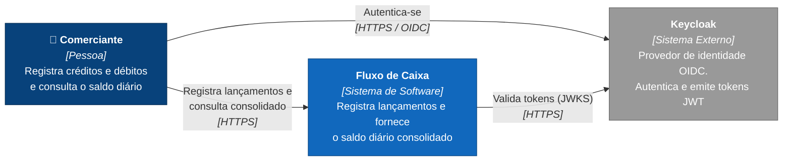

# C4 — Nível 1: Diagrama de Contexto

> Fonte formal: [`workspace.dsl`](workspace.dsl), visão `C1-Contexto`. Este diagrama em Mermaid é derivado dela para renderizar direto no GitHub.

Mostra **quem usa** o sistema e **com quais sistemas externos** ele se relaciona, sem detalhes técnicos internos.

## Elementos

| Elemento | Tipo | Responsabilidade |
|---|---|---|
| **Comerciante** | Pessoa | Dono do caixa. Registra lançamentos (créditos/débitos), estorna lançamentos incorretos e consulta o saldo diário consolidado. |
| **Fluxo de Caixa** | Sistema (escopo do desafio) | Mantém os lançamentos (fonte da verdade) e a projeção de saldos diários. |
| **Keycloak** | Sistema externo | Identidade e acesso: login OIDC (Authorization Code + PKCE), emissão de JWT com a role `comerciante`, publicação das chaves (JWKS) para validação. |

## Decisões refletidas neste nível

- **A identidade é delegada a um IdP padrão de mercado** em vez de autenticação própria: menos superfície de ataque e suporte a MFA, SSO e federação sem código novo. Ver ADR de autenticação em [`docs/adr`](../adr).
- **O escopo é um único comerciante por usuário**, mas os dados já são particionados por `ComercianteId`, o que prepara o sistema para multi-tenant.
