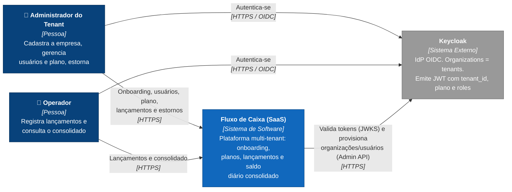

# C4 — Nível 1: Diagrama de Contexto

> Fonte formal: [`workspace.dsl`](workspace.dsl), visão `C1-Contexto`. Este diagrama em Mermaid é derivado dela para renderizar direto no GitHub.

Mostra **quem usa** a plataforma SaaS e **com quais sistemas externos** ela se relaciona, sem detalhes técnicos internos.

## Elementos

| Elemento | Tipo | Responsabilidade |
|---|---|---|
| **Administrador do Tenant** | Pessoa | Usuário `admin` de uma empresa cliente. Faz o onboarding da empresa, escolhe o plano, cria usuários, registra e **estorna** lançamentos e consulta o consolidado. |
| **Operador** | Pessoa | Usuário `operador` da empresa. Registra lançamentos e consulta o consolidado. |
| **Fluxo de Caixa (SaaS)** | Sistema (escopo do desafio) | Plataforma multi-tenant: mantém os tenants e planos, os lançamentos (fonte da verdade) e a projeção de saldos diários, isolando os dados de cada empresa. |
| **Keycloak** | Sistema externo | Identidade e acesso: cada tenant é uma **Organization**. Login OIDC (Authorization Code + PKCE), JWT com `tenant_id`, `plano` e roles (`admin`, `operador`), JWKS para validação e Admin API para provisionamento. |

## Decisões refletidas neste nível

- **O produto é um SaaS multi-tenant** com isolamento lógico por `TenantId`. Ver [ADR-0015](../adr/0015-multi-tenancy-banco-compartilhado.md).
- **A identidade é delegada a um IdP padrão de mercado** em vez de autenticação própria: menos superfície de ataque e suporte a MFA, SSO e federação sem código novo. Ver [ADR-0008](../adr/0008-autenticacao-keycloak-oidc-jwt.md).
- **O onboarding é em autoatendimento:** a plataforma provisiona a organização e o admin no Keycloak. Ver [ADR-0017](../adr/0017-contexto-plataforma-onboarding-planos.md).
