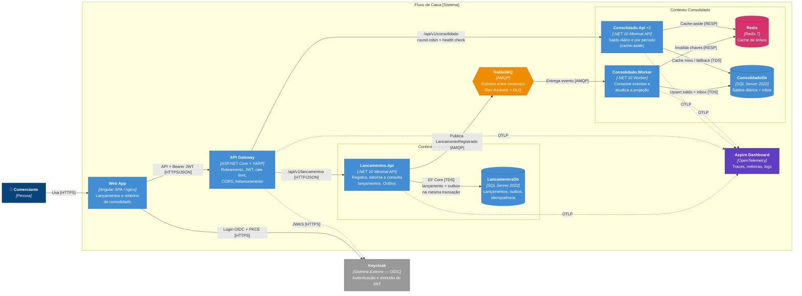

# C4 — Nível 2: Diagrama de Containers

> Fonte formal: [`workspace.dsl`](workspace.dsl), visão `C2-Containers`.

Mostra as **unidades executáveis e de dados** do sistema, as tecnologias de cada uma e como se comunicam.

## Containers

| Container | Tecnologia | Responsabilidade | Escala |
|---|---|---|---|
| **Web App** | Angular (standalone, signals), nginx | UI do comerciante; login OIDC; trata a indisponibilidade do consolidado sem afetar os lançamentos. | Estático (CDN em produção) |
| **API Gateway** | ASP.NET Core + YARP | Entrada única; valida JWT; rate limiting por usuário; CORS; balanceia entre réplicas com health check ativo; timeouts e circuit breaker. | Horizontal, stateless |
| **Lancamentos.Api** | .NET 10 Minimal API, EF Core, MassTransit | Commands e queries de lançamentos; grava o evento no **outbox** na mesma transação. | Horizontal, stateless |
| **LancamentosDb** | SQL Server 2022 | Fonte da verdade dos lançamentos. | Vertical + réplicas de leitura (futuro) |
| **RabbitMQ** | RabbitMQ 4 | Desacopla os contextos; buffer em picos; retry e DLQ. | Cluster com quorum queues (produção) |
| **Consolidado.Worker** | .NET 10 Worker, MassTransit, EF Core | Aplica os eventos no `SaldoDiario` de forma idempotente e invalida o cache. | Horizontal por tamanho de fila (KEDA) |
| **Consolidado.Api** | .NET 10 Minimal API, EF Core, Redis | Consultas de saldo com cache-aside; se o Redis falhar, lê do banco. | **2 réplicas** localmente; HPA em produção |
| **ConsolidadoDb** | SQL Server 2022 | Projeção de saldos e inbox. | Independente de LancamentosDb |
| **Redis** | Redis 7 | Cache das consultas de consolidado. | Réplica / cluster (produção) |
| **Aspire Dashboard** | OpenTelemetry (OTLP) | Observabilidade local (traces distribuídos, incluindo a passagem pela fila). | Em produção: Azure Monitor |

## Como a arquitetura atende aos requisitos não funcionais

1. **"Lançamentos não pode cair se o Consolidado cair"**
   - Não existe **nenhuma chamada síncrona** de Lançamentos para o Consolidado.
   - O Lancamentos.Api só depende do próprio banco para aceitar um lançamento. O evento vai para o **outbox** na mesma transação e é publicado depois.
   - Se o **RabbitMQ** cair, o lançamento continua sendo aceito e o outbox publica quando o broker voltar.
   - Se o **Consolidado** cair, os eventos se acumulam na fila durável e são processados quando ele voltar.
2. **"Consolidado: 50 req/s com no máximo 5% de perda"**
   - A leitura passa pelo **cache Redis**. Um dia consultado repetidas vezes gera uma única ida ao banco até a invalidação.
   - Há **2 réplicas** da API atrás do gateway, com health check ativo que retira a réplica doente do balanceamento.
   - Se o Redis falhar, a API **lê do banco** em vez de devolver erro.
   - Escrita (Worker) e leitura (Api) ficam em **processos separados**, então picos de consulta não competem com o processamento de eventos.
   - O **rate limiting** no gateway protege contra abuso sem descartar o tráfego legítimo de 50 rps.
3. **Segurança:** JWT validado no gateway **e** nos serviços (defesa em profundidade), TLS na borda, segredos fora do repositório, `ComercianteId` extraído do token.

Detalhes e metas numéricas: [requisitos não funcionais](../requisitos-nao-funcionais.md). Comportamento em falhas: [fluxos](fluxos.md).

## Decisões relacionadas

| Container / aspecto | ADR |
|---|---|
| Separação em serviços | [ADR-0002](../adr/0002-microsservicos-por-bounded-context.md) |
| RabbitMQ | [ADR-0004](../adr/0004-comunicacao-assincrona-rabbitmq.md), [ADR-0005](../adr/0005-outbox-e-consumidor-idempotente.md) |
| Redis | [ADR-0006](../adr/0006-cache-aside-redis.md) |
| SQL Server (LancamentosDb / ConsolidadoDb) | [ADR-0007](../adr/0007-sql-server-ef-core-database-per-service.md) |
| Keycloak | [ADR-0008](../adr/0008-autenticacao-keycloak-oidc-jwt.md) |
| API Gateway | [ADR-0009](../adr/0009-api-gateway-yarp.md) |
| Consolidado.Api × Consolidado.Worker | [ADR-0010](../adr/0010-separacao-consolidado-api-worker.md) |
| Aspire Dashboard / OpenTelemetry | [ADR-0011](../adr/0011-observabilidade-opentelemetry.md) |
