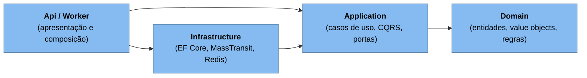
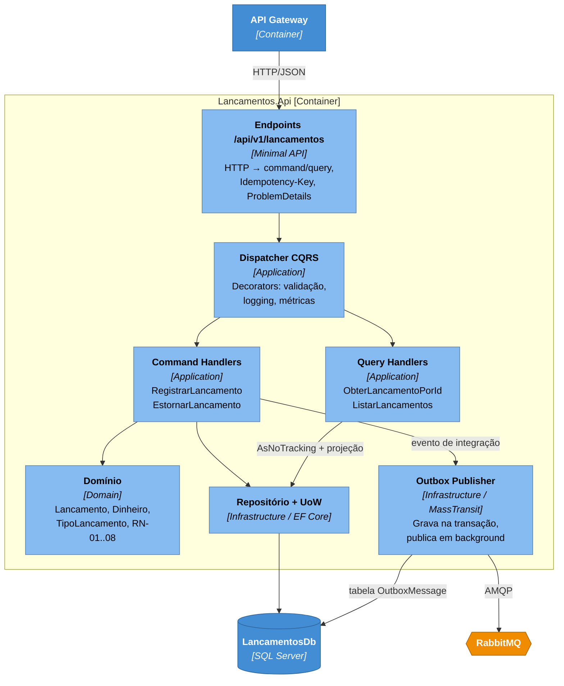
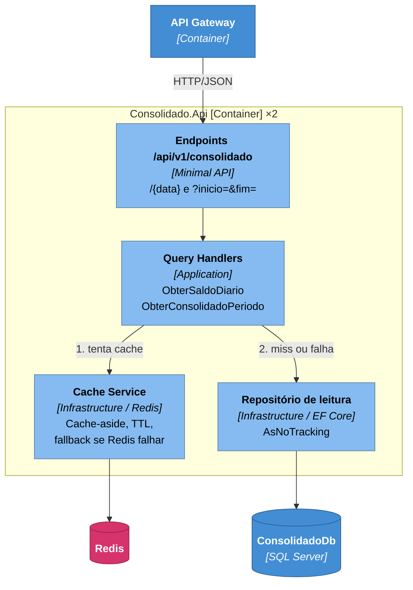
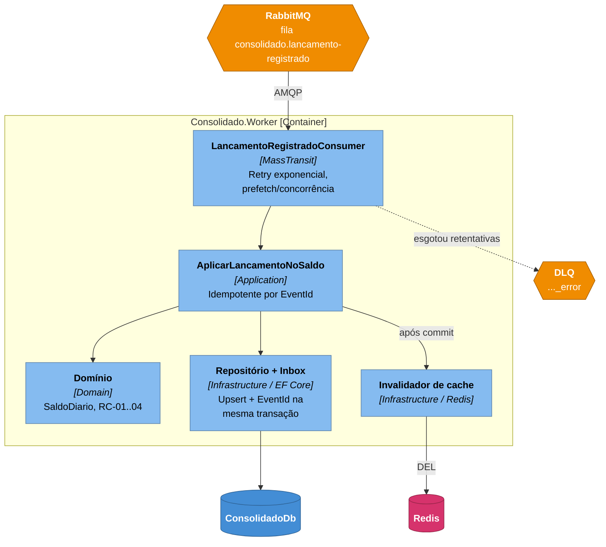

# C4 — Nível 3: Diagramas de Componentes

> Fonte formal: [`workspace.dsl`](workspace.dsl), visões `C3-Componentes-*`.

Cada serviço segue **Clean Architecture** com **CQRS**. As dependências apontam sempre **para dentro**:

| Camada | Pode depender de | Não pode depender de |
|---|---|---|
| **Domain** | `FluxoCaixa.SharedKernel` | Application, Infrastructure, EF Core, ASP.NET |
| **Application** | Domain, SharedKernel, Contracts | Infrastructure, EF Core, MassTransit, Redis |
| **Infrastructure** | Application, Domain | Api |
| **Api / Worker** | Todas (composition root) | — |

Essas regras são **verificadas automaticamente** por testes de arquitetura (NetArchTest) em `tests/Architecture.Tests`.

---

## 3.1 Lancamentos.Api

| Componente | Responsabilidade | Padrões |
|---|---|---|
| Endpoints | Traduz HTTP para commands/queries; extrai `ComercianteId` do JWT; aplica `Idempotency-Key`; mapeia `Result` para status HTTP/ProblemDetails (RFC 9457). | Minimal API, Adapter |
| Dispatcher CQRS | Resolve `ICommandHandler<TCommand, TResult>` e `IQueryHandler<TQuery, TResult>` via DI; encadeia os decorators. | Mediator, Decorator (Chain of Responsibility) |
| Command Handlers | Orquestram o caso de uso: carregam o agregado, executam a regra, persistem e registram o evento. | Unit of Work, Result pattern |
| Query Handlers | Leitura direta, sem tracking, projetada em DTOs. Não passam pelo agregado. | CQRS (lado de leitura) |
| Domínio | Invariantes RN-01..RN-08; factory methods (`Lancamento.Criar`, `lancamento.Estornar()`); eventos de domínio. | DDD: Aggregate, Value Object, Domain Event |
| Repositório + UoW | Abstrai o EF Core atrás de interfaces (portas) definidas na Application. | Repository, Dependency Inversion |
| Outbox Publisher | Garante **at-least-once** sem transação distribuída. | Transactional Outbox |

---

## 3.2 Consolidado.Api (leitura)

| Componente | Responsabilidade | Padrões |
|---|---|---|
| Endpoints | Validação de parâmetros (data, período máx. 93 dias) e autorização. | Minimal API |
| Query Handlers | Montam a resposta; dias sem movimento retornam saldo zero (RC-03). | CQRS (leitura) |
| Cache Service | Chaves `consolidado:{comercianteId}:{yyyy-MM-dd}`; TTL curto para o dia corrente e mais longo para dias passados; timeout agressivo (≈50 ms) com **fallback para o banco**. | Cache-aside, Circuit Breaker |
| Repositório de leitura | Consultas indexadas por `(ComercianteId, Data)`. | Repository |

---

## 3.3 Consolidado.Worker (escrita da projeção)

| Componente | Responsabilidade | Padrões |
|---|---|---|
| Consumer | Adapter do broker para o caso de uso; retry com backoff exponencial para falhas transitórias; mensagens que falham de vez vão para a DLQ. | Competing Consumers, Retry, Dead Letter Channel |
| AplicarLancamentoNoSaldo | Verifica se o `EventId` já está na inbox e ignora o evento se já foi processado. Se não, aplica no `SaldoDiario` e grava inbox + saldo na mesma transação. | Idempotent Receiver |
| Domínio | `SaldoDiario.Aplicar(tipo, valor)`, com operação comutativa. | DDD Aggregate |
| Repositório + Inbox | Upsert com concorrência otimista (`rowversion`); conflito leva a retry. | Inbox, Optimistic Concurrency |
| Invalidador | Remove a chave do dia afetado após o commit. Se falhar, o TTL limita o tempo de dado desatualizado. | Cache invalidation |

---

## Building blocks compartilhados

| Projeto | Conteúdo | Regra |
|---|---|---|
| `FluxoCaixa.SharedKernel` | `Entity`, `AggregateRoot`, `ValueObject`, `Result<T>`, `Error`, abstrações CQRS (`ICommand`, `IQuery`, handlers, `IDispatcher`). | Sem dependências externas. |
| `FluxoCaixa.Contracts` | Eventos de integração versionados (`LancamentoRegistrado`). | Só records imutáveis e serializáveis; nenhum comportamento. |
