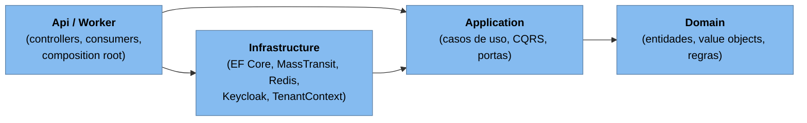
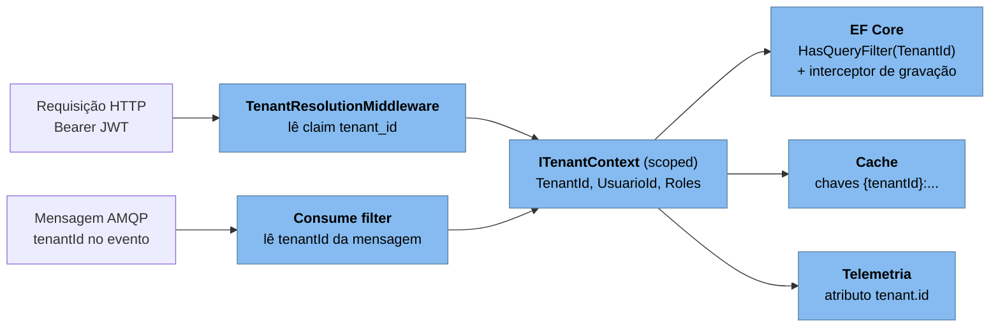
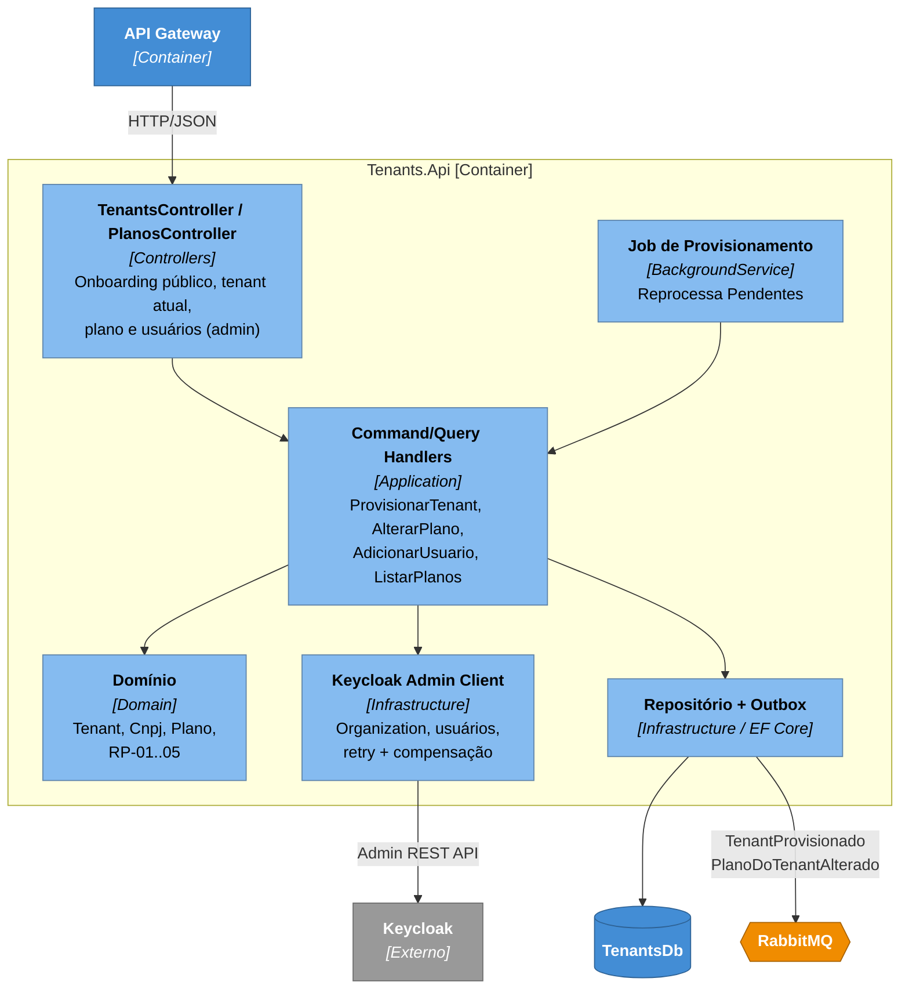
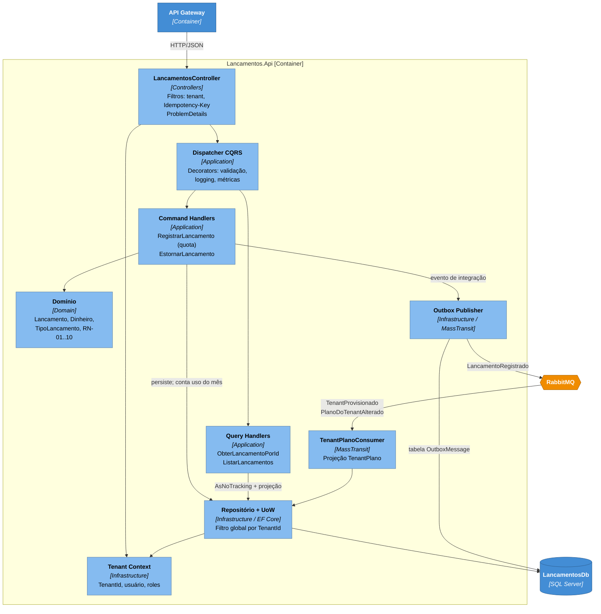
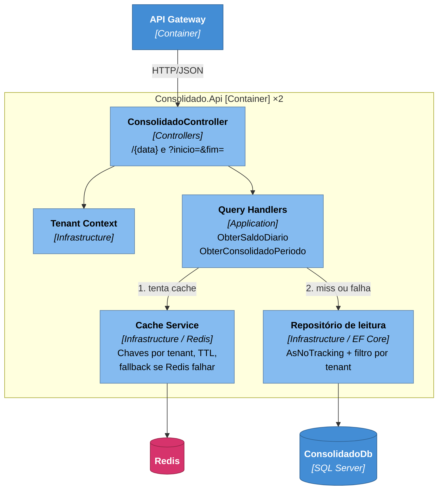
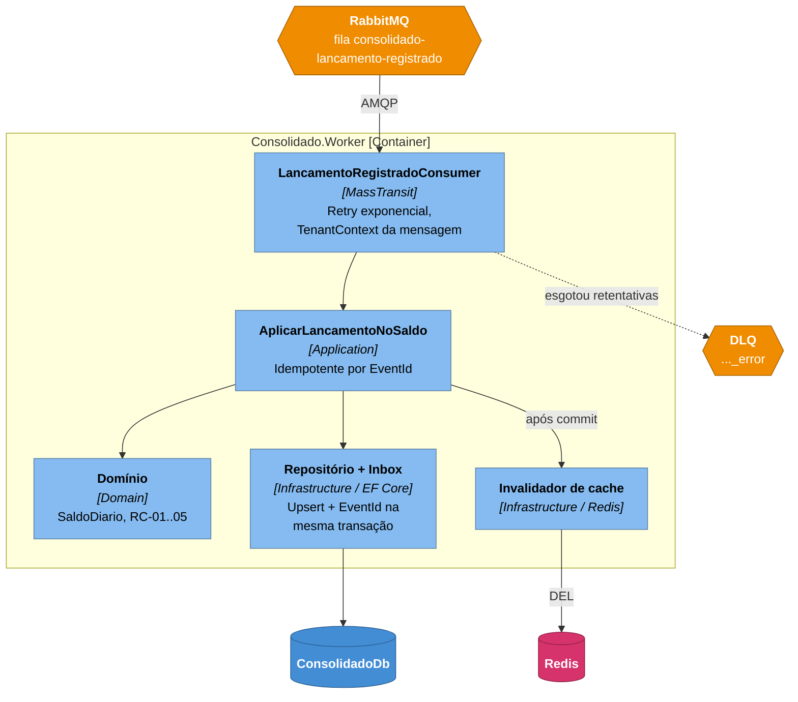

# C4 — Nível 3: Diagramas de Componentes

> Fonte formal: [`workspace.dsl`](workspace.dsl), visões `C3-Componentes-*`.

Cada serviço segue **Clean Architecture** com **CQRS**. As dependências apontam sempre **para dentro**:

| Camada | Pode depender de | Não pode depender de |
|---|---|---|
| **Domain** | `FluxoCaixa.SharedKernel` | Application, Infrastructure, EF Core, ASP.NET |
| **Application** | Domain, SharedKernel, Contracts | Infrastructure, EF Core, MassTransit, Redis |
| **Infrastructure** | Application, Domain | Api |
| **Api / Worker** | Todas (composition root) | — |

Essas regras são **verificadas automaticamente** por testes de arquitetura (NetArchTest) em `tests/Architecture.Tests`. Os testes também verificam que **controllers não dependem de Infrastructure/`DbContext`** e que **toda entidade de negócio implementa `ITenantEntity`**. Decisões: [ADR-0003](../adr/0003-clean-architecture-cqrs.md), [ADR-0015](../adr/0015-multi-tenancy-banco-compartilhado.md), [ADR-0016](../adr/0016-web-api-com-controllers.md). Bibliotecas: [ADR-0013](../adr/0013-bibliotecas-e-licencas.md).

## Multi-tenancy transversal (todos os serviços)

| Componente | Local | Responsabilidade |
|---|---|---|
| `ITenantContext` | SharedKernel (abstração) / Infrastructure (implementação) | Expõe `TenantId`, `UsuarioId` e papéis da execução corrente. |
| `TenantResolutionMiddleware` | Infrastructure (web) | Preenche o contexto pelo JWT; sem `tenant_id` responde 403 (MT-04). |
| `TenantConsumeFilter` | Infrastructure (mensageria) | Preenche o contexto pelo `tenantId` do evento. |
| `TenantSaveChangesInterceptor` | Infrastructure (EF Core) | Preenche o `TenantId` em inserções e bloqueia gravação de outro tenant. |
| Filtro global | `DbContext` | `HasQueryFilter(e => e.TenantId == tenant.TenantId)` em toda `ITenantEntity`. |

---

## 3.1 Tenants.Api (Plataforma)

| Componente | Responsabilidade | Padrões |
|---|---|---|
| Controllers | Onboarding (`[AllowAnonymous]` + rate limit por IP), tenant atual, troca de plano e usuários (`[Authorize(Policy = "Admin")]`). | ASP.NET Core Controllers |
| Handlers | `ProvisionarTenant` orquestra a saga: `Pendente` → Keycloak → `Ativo` + evento, ou compensação. | Saga orquestrada, Result pattern |
| Domínio | Validação de CNPJ, transições de status, limites do plano. | DDD Aggregate, Value Object |
| Keycloak Admin Client | Porta `IIdentityProvisioner` implementada com HttpClient + resiliência; conta de serviço com permissões mínimas. | Adapter, Retry, Compensating Transaction |
| Job de Provisionamento | Reconciliação periódica de tenants `Pendente`. | Scheduler Agent Supervisor |
| Repositório + Outbox | Persistência e publicação confiável dos eventos. | Transactional Outbox |

---

## 3.2 Lancamentos.Api

| Componente | Responsabilidade | Padrões |
|---|---|---|
| LancamentosController | Traduz HTTP para commands/queries; aplica `Idempotency-Key` (escopo tenant); mapeia `Result` para status HTTP/ProblemDetails (RFC 9457); políticas `Operador`/`Admin` (RN-10). | Controllers finos, Adapter |
| Tenant Context | Identidade da execução (MT-02). | Context Object |
| Dispatcher CQRS | Resolve `ICommandHandler<TCommand, TResult>` e `IQueryHandler<TQuery, TResult>` via DI; encadeia os decorators. | Mediator, Decorator |
| Command Handlers | Carregam o agregado, verificam a **quota** (RN-09), executam a regra, persistem e registram o evento. | Unit of Work, Result pattern |
| Query Handlers | Leitura direta, sem tracking, projetada em DTOs. | CQRS (lado de leitura) |
| Domínio | Invariantes RN-01..RN-06; factory methods (`Lancamento.Criar`, `lancamento.Estornar()`); eventos de domínio. | DDD: Aggregate, Value Object, Domain Event |
| Repositório + UoW | Abstrai o EF Core atrás de portas definidas na Application; filtro global por tenant. | Repository, Dependency Inversion |
| Outbox Publisher | Garante **at-least-once** sem transação distribuída. | Transactional Outbox |
| TenantPlanoConsumer | Mantém a projeção do plano (idempotente; ignora eventos mais antigos). | Event-carried State Transfer |

---

## 3.3 Consolidado.Api (leitura)

| Componente | Responsabilidade | Padrões |
|---|---|---|
| ConsolidadoController | Validação de parâmetros (data, período máx. 93 dias) e autorização (`Operador`). | Controllers |
| Query Handlers | Montam a resposta; dias sem movimento retornam saldo zero (RC-03). | CQRS (leitura) |
| Cache Service | Chaves `consolidado:{tenantId}:{yyyy-MM-dd}`; TTL curto para o dia corrente e mais longo para dias passados; timeout agressivo (≈50 ms) com **fallback para o banco**. | Cache-aside, Circuit Breaker |
| Repositório de leitura | Consultas indexadas por `(TenantId, Data)`. | Repository |

---

## 3.4 Consolidado.Worker (escrita da projeção)

| Componente | Responsabilidade | Padrões |
|---|---|---|
| Consumer | Adapter do broker para o caso de uso; define o tenant a partir do evento; retry com backoff exponencial; mensagens que falham de vez vão para a DLQ. | Competing Consumers, Retry, Dead Letter Channel |
| AplicarLancamentoNoSaldo | Verifica se o `EventId` já está na inbox e ignora o evento se já foi processado. Se não, aplica no `SaldoDiario` e grava inbox + saldo na mesma transação. | Idempotent Receiver |
| Domínio | `SaldoDiario.Aplicar(tipo, valor)`, com operação comutativa. | DDD Aggregate |
| Repositório + Inbox | Upsert com concorrência otimista (`rowversion`); conflito leva a retry. | Inbox, Optimistic Concurrency |
| Invalidador | Remove a chave do tenant/dia afetado após o commit. Se falhar, o TTL limita o tempo de dado desatualizado. | Cache invalidation |

---

## Building blocks compartilhados

| Projeto | Conteúdo | Regra |
|---|---|---|
| `FluxoCaixa.SharedKernel` | `Entity`, `AggregateRoot`, `ValueObject`, `Result<T>`, `Error`, abstrações CQRS (`ICommand`, `IQuery`, handlers, `IDispatcher`), `ITenantContext`, `ITenantEntity`. | Sem dependências externas. |
| `FluxoCaixa.Application.Common` | Implementação do `IDispatcher`, decorators de validação (FluentValidation) e logging, registro dos handlers via DI. | Referenciado pelas camadas Application; sem dependência de infraestrutura (EF, ASP.NET, broker). |
| `FluxoCaixa.Contracts` | Eventos de integração versionados (`LancamentoRegistrado`, `TenantProvisionado`, `PlanoDoTenantAlterado`), todos com `TenantId`. | Só records imutáveis e serializáveis; nenhum comportamento. |
| `FluxoCaixa.Infrastructure.Common` | Implementações transversais: middleware/filtro de tenant, interceptor EF, configuração de OpenTelemetry, autenticação JWT, ProblemDetails. | Referenciado apenas por Infrastructure e Api/Worker. |
