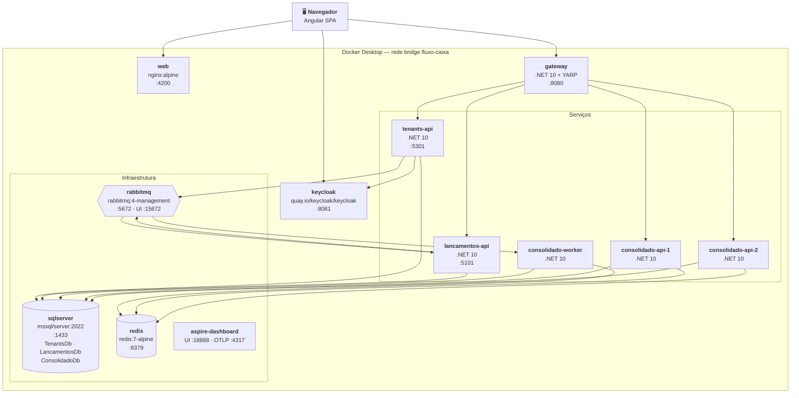
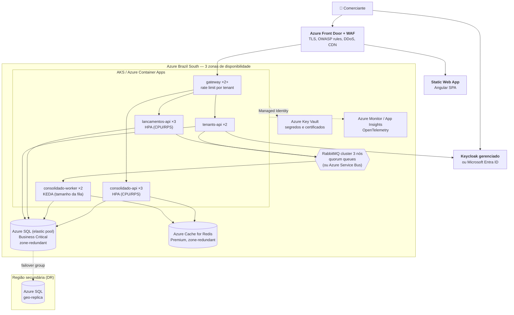

# Visão de Implantação

> Fonte formal: [`workspace.dsl`](workspace.dsl), visões `Deploy-Local` e `Deploy-Producao`.

## 1. Ambiente local (Docker Compose)

Um único `docker compose up` sobe toda a solução, incluindo a infraestrutura.

| Serviço | Imagem | Porta no host | Healthcheck | Observação |
|---|---|---|---|---|
| `web` | nginx:alpine (build multi-stage) | 4200 | `GET /` | SPA |
| `gateway` | .NET 10 (build) | 8080 | `/health/ready` | Única porta de API exposta para a SPA |
| `tenants-api` | .NET 10 (build) | 5301 (debug) | `/health/ready` | Onboarding, planos, usuários; usa a Admin API do Keycloak |
| `lancamentos-api` | .NET 10 (build) | 5101 (debug) | `/health/ready` | Também consome eventos de tenant/plano |
| `consolidado-api-1/2` | .NET 10 (build) | — | `/health/ready` | Acesso **somente via gateway**; duas instâncias explícitas para demonstrar balanceamento e failover |
| `consolidado-worker` | .NET 10 (build) | — | `/health/live` | |
| `sqlserver` | mcr.microsoft.com/mssql/server:2022-latest | 1433 | `sqlcmd SELECT 1` | Um banco por serviço: `TenantsDb`, `LancamentosDb`, `ConsolidadoDb` |
| `rabbitmq` | rabbitmq:4-management | 5672 / 15672 | `rabbitmq-diagnostics ping` | Definições (exchanges/filas) importadas no start |
| `redis` | redis:7-alpine | 6379 | `redis-cli ping` | |
| `keycloak` | quay.io/keycloak/keycloak | 8081 | `/health/ready` | Realm `fluxo-caixa` com Organizations habilitado, clientes (SPA, API, conta de serviço do Tenants.Api) e **dois tenants de demonstração** (Free e Pro), com usuários `admin` e `operador` |
| `aspire-dashboard` | mcr.microsoft.com/dotnet/aspire-dashboard | 18888 / 4317 | — | Traces, métricas e logs |

**Resiliência local:**
- `restart: unless-stopped` em todos os serviços.
- `depends_on` com `condition: service_healthy`.
- Migrations do EF aplicadas na inicialização, com retry até o SQL Server ficar saudável.

## 2. Produção (visão alvo — Azure)

Não faz parte da entrega executável. Documenta **como a mesma arquitetura escalaria** em um ambiente real.

| Preocupação | Estratégia |
|---|---|
| **Escalabilidade** | Pods stateless com HPA; o Worker escala por KEDA conforme o tamanho da fila. Bancos em **elastic pool**; tenants grandes podem migrar para banco dedicado (modelo híbrido, [ADR-0015](../adr/0015-multi-tenancy-banco-compartilhado.md)). |
| **Alta disponibilidade** | Réplicas distribuídas em 3 zonas; banco, cache e broker zone-redundant. |
| **Disaster recovery** | Azure SQL com failover group para a região secundária; infraestrutura como código (Bicep/Terraform) para recriar o cluster. |
| **Segurança** | WAF na borda; Managed Identity para acessar SQL e Key Vault (sem senha em configuração); rede privada (Private Endpoints) para dados. |
| **Multi-tenancy** | Métricas e custos por `tenant.id`; rate limit por plano no gateway (ou APIM com políticas por produto/assinatura). |
| **Deploy** | GitHub Actions: build, testes, imagem, deploy **blue/green ou canário** com rollback automático por SLO. |
