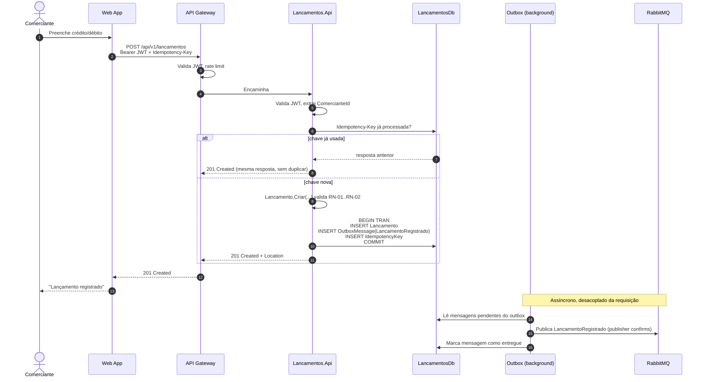
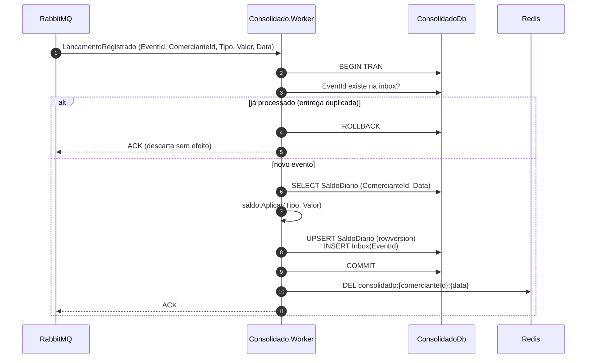
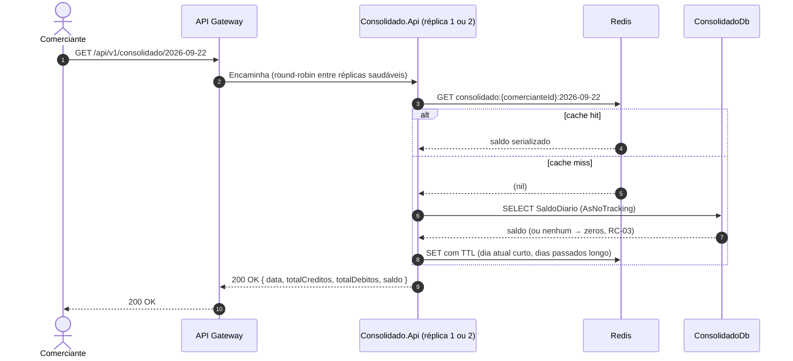
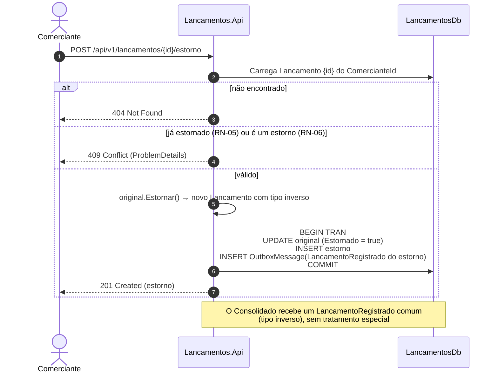
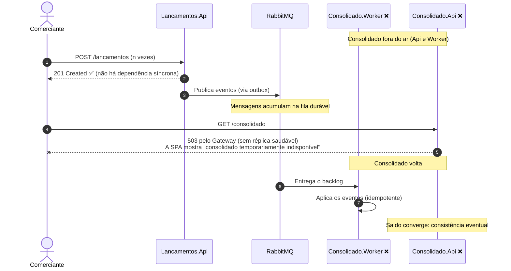
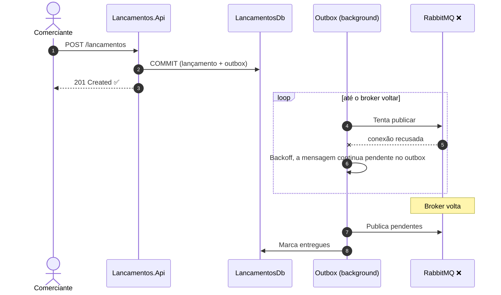
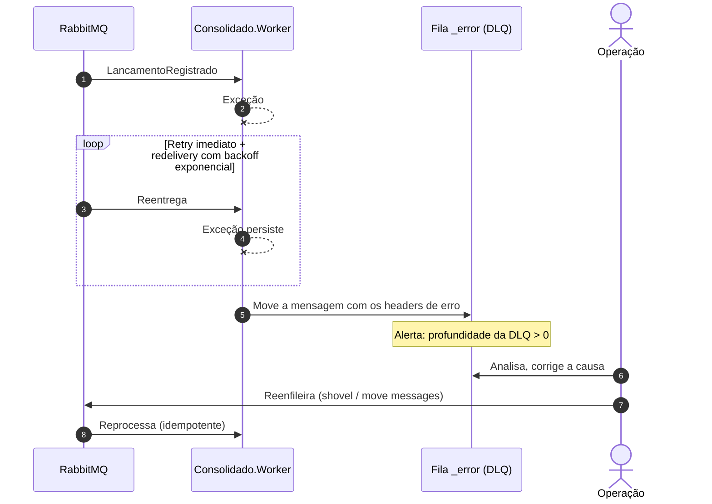
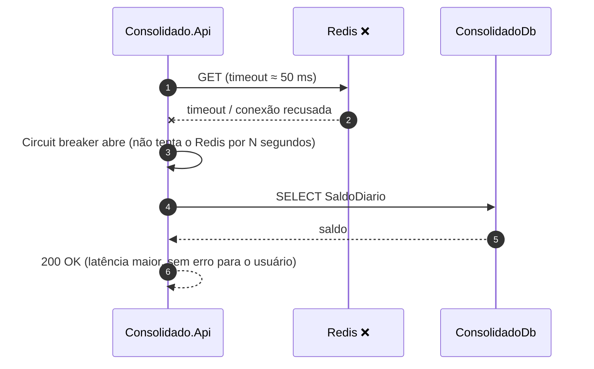

# Fluxos de Dados (Diagramas de Sequência)

Comportamento dinâmico da solução nos caminhos principais e nos cenários de falha.

1. [Registrar lançamento](#1-registrar-lançamento)
2. [Consolidação assíncrona](#2-consolidação-assíncrona)
3. [Consulta do consolidado com cache](#3-consulta-do-consolidado-com-cache)
4. [Estorno](#4-estorno)
5. [Falha: Consolidado indisponível](#5-falha-consolidado-indisponível)
6. [Falha: RabbitMQ indisponível](#6-falha-rabbitmq-indisponível)
7. [Falha: mensagem com erro permanente (DLQ)](#7-falha-mensagem-com-erro-permanente-dlq)
8. [Falha: Redis indisponível](#8-falha-redis-indisponível)

---

## 1. Registrar lançamento

Lançamento e evento são gravados **na mesma transação** (Transactional Outbox). A resposta ao cliente **não depende** do broker nem do Consolidado.

**Validação inválida:** o Lancamentos.Api responde `400` com `ValidationProblemDetails` (RFC 9457) e não grava nada.

---

## 2. Consolidação assíncrona

**Garantias:**
- **At-least-once** na entrega e **exactly-once** no efeito, graças à inbox na mesma transação.
- A ordem dos eventos não importa, porque a soma é comutativa.
- Um conflito de concorrência (`rowversion`) gera exceção, e o retry reaplica a mensagem, que continua idempotente.

---

## 3. Consulta do consolidado com cache

---

## 4. Estorno

---

## 5. Falha: Consolidado indisponível

Este é o cenário central do requisito não funcional: **Lançamentos continua disponível.**

---

## 6. Falha: RabbitMQ indisponível

Nenhum lançamento se perde (RPO ≈ 0): o banco guarda o evento até a publicação.

---

## 7. Falha: mensagem com erro permanente (DLQ)

---

## 8. Falha: Redis indisponível

O cache é **otimização, nunca dependência**: a falha dele degrada a latência, mas não a disponibilidade.
