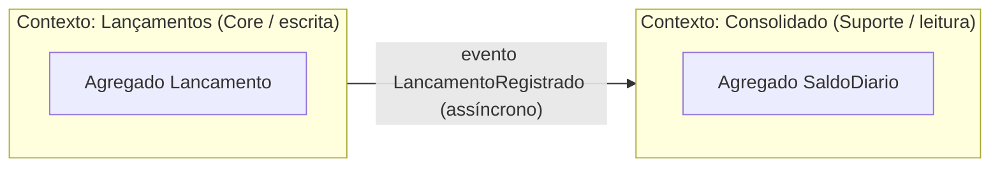

# Modelo de Domínio

Este documento define a **linguagem ubíqua**, os **bounded contexts**, os **agregados**, as **regras de negócio** e os **eventos** da solução. Código, testes, APIs e diagramas usam exatamente estes termos.

## 1. Problema

Um comerciante precisa **controlar o fluxo de caixa diário** registrando lançamentos de débito e de crédito, e precisa de um **relatório com o saldo diário consolidado**.

## 2. Linguagem ubíqua

| Termo | Definição |
|---|---|
| **Comerciante** | Usuário dono do caixa. Identificado pelo `sub` do token JWT emitido pelo Keycloak. Todo dado é particionado por comerciante. |
| **Lançamento** | Registro imutável de uma entrada (crédito) ou saída (débito) de dinheiro no caixa, em uma data de competência. |
| **Crédito** | Lançamento que **aumenta** o saldo (ex.: venda recebida). |
| **Débito** | Lançamento que **diminui** o saldo (ex.: pagamento a fornecedor). |
| **Valor** | Quantia monetária positiva, em reais (BRL), com 2 casas decimais. O sinal é dado pelo **tipo**, nunca pelo valor. |
| **Data de competência** | Dia do caixa ao qual o lançamento pertence. É a chave da consolidação. |
| **Estorno** | Lançamento de tipo **inverso** que anula um lançamento anterior. É a única forma de "corrigir" um lançamento. |
| **Saldo diário** | Resultado consolidado de um dia: `total de créditos − total de débitos`. |
| **Consolidado** | Relatório de saldos diários de um comerciante para um dia ou período. |

## 3. Bounded contexts



| Contexto | Tipo | Responsabilidade | Dono dos dados |
|---|---|---|---|
| **Lançamentos** | Core domain | Registrar e consultar lançamentos; garantir as regras de negócio. **Fonte da verdade.** | `LancamentosDb` |
| **Consolidado** | Supporting domain | Manter uma **projeção** de saldos por dia, otimizada para leitura. | `ConsolidadoDb` |

**Relação entre os contextos:** o Consolidado é *downstream* e *conformista* ao evento publicado por Lançamentos (Published Language: `FluxoCaixa.Contracts`). **Lançamentos não conhece o Consolidado**, e esse desacoplamento garante o requisito de disponibilidade.

## 4. Contexto Lançamentos

### 4.1 Agregado `Lancamento`

| Atributo | Tipo | Regra |
|---|---|---|
| `Id` | `Guid` (v7, ordenável) | Gerado na criação. |
| `ComercianteId` | `string` | Obrigatório; vem do token, **nunca do corpo da requisição**. |
| `Tipo` | `TipoLancamento` (`Credito` \| `Debito`) | Obrigatório. |
| `Valor` | `Dinheiro` (value object) | `> 0` e `≤ 999.999.999,99`; no máximo 2 casas decimais; persistido como `decimal(18,2)`. |
| `DataCompetencia` | `DateOnly` | Obrigatória; **não pode ser futura** (fuso `America/Sao_Paulo`). |
| `Descricao` | `string` | Obrigatória, 3 a 200 caracteres. |
| `LancamentoOriginalId` | `Guid?` | Preenchido apenas em estornos. |
| `Estornado` | `bool` | `true` quando já existe estorno para este lançamento. |
| `CriadoEm` | `DateTimeOffset` (UTC) | Carimbo de auditoria. |

### 4.2 Regras de negócio (invariantes)

| # | Regra |
|---|---|
| RN-01 | Um lançamento deve ter tipo, valor positivo, data de competência e descrição válidos. |
| RN-02 | A data de competência não pode ser futura. |
| RN-03 | Lançamentos são **imutáveis**: não há edição nem exclusão (trilha de auditoria contábil). |
| RN-04 | A correção é feita por **estorno**: um novo lançamento com o **tipo inverso**, **mesmo valor** e **mesma data de competência** do original. Assim o saldo do dia afetado é corrigido. |
| RN-05 | Um lançamento só pode ser estornado **uma vez**. |
| RN-06 | Um estorno **não pode** ser estornado. |
| RN-07 | Um comerciante só acessa os próprios lançamentos. |
| RN-08 | O registro de um lançamento é **idempotente** pela chave `Idempotency-Key` enviada pelo cliente, o que evita duplicidade em retentativas. |

> **Decisão de modelagem (RN-04):** o estorno usa a data de competência do lançamento original porque o objetivo é corrigir o caixa daquele dia. Em uma evolução com **fechamento de caixa**, estornos de dias já fechados passariam a ser lançados na data corrente (ver [evolução futura](evolucao-futura.md)).

### 4.3 Casos de uso (CQRS)

| Tipo | Caso de uso | Descrição |
|---|---|---|
| Command | `RegistrarLancamento` | Valida, persiste o lançamento e grava o evento no outbox (mesma transação). |
| Command | `EstornarLancamento` | Marca o original como estornado, cria o lançamento inverso e grava o evento no outbox. |
| Query | `ObterLancamentoPorId` | Retorna um lançamento do comerciante. |
| Query | `ListarLancamentos` | Lista os lançamentos de uma data de competência, com paginação. |

## 5. Contexto Consolidado

### 5.1 Agregado `SaldoDiario`

| Atributo | Tipo | Regra |
|---|---|---|
| `ComercianteId` + `Data` | chave composta | Um registro por comerciante por dia. |
| `TotalCreditos` | `decimal(18,2)` | Soma dos créditos do dia (`≥ 0`). |
| `TotalDebitos` | `decimal(18,2)` | Soma dos débitos do dia (`≥ 0`). |
| `Saldo` | `decimal(18,2)` | Calculado: `TotalCreditos − TotalDebitos` (pode ser negativo). |
| `QuantidadeLancamentos` | `int` | Número de lançamentos aplicados. |
| `AtualizadoEm` | `DateTimeOffset` | Última aplicação de evento. |
| `Versao` | `rowversion` | Controle de concorrência otimista. |

### 5.2 Regras

| # | Regra |
|---|---|
| RC-01 | Cada evento `LancamentoRegistrado` é aplicado **exatamente uma vez**: o `EventId` fica registrado na tabela de inbox na mesma transação do saldo (**consumidor idempotente**). |
| RC-02 | A aplicação é **comutativa** (somas), então a **ordem de chegada dos eventos não altera o resultado**. |
| RC-03 | Um dia sem lançamentos tem saldo `0,00`. A consulta retorna zeros em vez de 404. |
| RC-04 | O consolidado tem **consistência eventual** em relação aos lançamentos. A meta de atraso está em [requisitos não funcionais](requisitos-nao-funcionais.md). |

### 5.3 Casos de uso (CQRS)

| Tipo | Caso de uso | Onde executa |
|---|---|---|
| Command | `AplicarLancamentoNoSaldo` (disparado por evento) | `Consolidado.Worker` |
| Query | `ObterSaldoDiario(data)` | `Consolidado.Api`, com cache |
| Query | `ObterConsolidadoPeriodo(inicio, fim)` | `Consolidado.Api`, com cache; período máximo de 93 dias |

## 6. Eventos

### 6.1 Evento de domínio × evento de integração

- **Eventos de domínio** (`LancamentoCriado`, `LancamentoEstornado`) circulam **dentro** do contexto Lançamentos.
- O **evento de integração** `LancamentoRegistrado` é o **contrato público** entre os contextos, versionado em `FluxoCaixa.Contracts`. Um estorno também gera um `LancamentoRegistrado` (com o tipo inverso), então o Consolidado trata um único tipo de evento.

### 6.2 Contrato `LancamentoRegistrado` (v1)

```json
{
  "eventId": "0192f7a0-8c1e-7c3a-9b6e-2f1d8e4a5b6c",
  "ocorridoEm": "2026-09-22T14:30:00Z",
  "versao": 1,
  "lancamentoId": "0192f7a0-8c1d-7a11-8f00-1a2b3c4d5e6f",
  "comercianteId": "5b1f9c2e-...-keycloak-sub",
  "tipo": "Credito",
  "valor": 150.75,
  "dataCompetencia": "2026-09-22",
  "lancamentoOriginalId": null
}
```

**Regras de evolução do contrato:** só se adicionam campos opcionais. Uma mudança incompatível gera um novo tipo `LancamentoRegistradoV2`, publicado em paralelo durante a migração dos consumidores.
