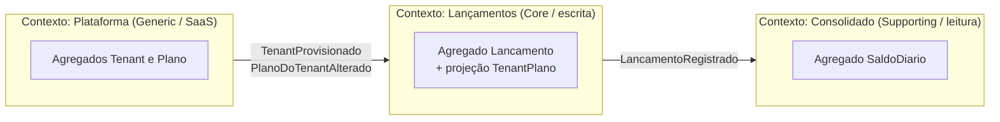

# Modelo de Domínio

Este documento define a **linguagem ubíqua**, os **bounded contexts**, os **agregados**, as **regras de negócio** e os **eventos** da solução. Código, testes, APIs e diagramas usam exatamente estes termos.

## 1. Problema

Um comerciante precisa **controlar o fluxo de caixa diário** registrando lançamentos de débito e de crédito, e precisa de um **relatório com o saldo diário consolidado**.

A solução é oferecida como **SaaS multi-tenant** ([ADR-0015](adr/0015-multi-tenancy-banco-compartilhado.md)): várias empresas usam a mesma plataforma, cada uma com seus usuários, seus dados isolados e um plano de assinatura.

## 2. Linguagem ubíqua

| Termo | Definição |
|---|---|
| **Tenant** | Empresa (comerciante) cliente do SaaS. Unidade de isolamento de dados, de cobrança e de limites. Corresponde a uma **Organization** no Keycloak. Identificado por `TenantId` (claim `tenant_id` do token). |
| **Usuário** | Pessoa que acessa a plataforma em nome de um tenant. Identificado pelo `sub` do token. |
| **Papel (role)** | `admin`: gerencia usuários e plano e pode estornar. `operador`: registra e consulta lançamentos e o consolidado. |
| **Plano** | Nível de assinatura (**Free**, **Pro**) que define as quotas e o rate limit do tenant. |
| **Quota** | Limite de uso do plano: lançamentos por mês e número de usuários. |
| **Onboarding** | Cadastro em autoatendimento de um novo tenant e do seu primeiro usuário `admin`. |
| **Lançamento** | Registro imutável de uma entrada (crédito) ou saída (débito) de dinheiro no caixa do tenant, em uma data de competência. |
| **Crédito** | Lançamento que **aumenta** o saldo (ex.: venda recebida). |
| **Débito** | Lançamento que **diminui** o saldo (ex.: pagamento a fornecedor). |
| **Valor** | Quantia monetária positiva, em reais (BRL), com 2 casas decimais. O sinal é dado pelo **tipo**, nunca pelo valor. |
| **Data de competência** | Dia do caixa ao qual o lançamento pertence. É a chave da consolidação. |
| **Estorno** | Lançamento de tipo **inverso** que anula um lançamento anterior. É a única forma de "corrigir" um lançamento. |
| **Saldo diário** | Resultado consolidado de um dia de um tenant: `total de créditos − total de débitos`. |
| **Consolidado** | Relatório de saldos diários de um tenant para um dia ou período. |

## 3. Bounded contexts



| Contexto | Tipo | Responsabilidade | Dono dos dados |
|---|---|---|---|
| **Plataforma** | Generic subdomain | Onboarding de tenants, catálogo de planos, quotas, gestão de usuários do tenant (via Keycloak). | `TenantsDb` |
| **Lançamentos** | Core domain | Registrar e consultar lançamentos; garantir as regras de negócio e a quota. **Fonte da verdade.** | `LancamentosDb` |
| **Consolidado** | Supporting domain | Manter uma **projeção** de saldos por tenant e por dia, otimizada para leitura. | `ConsolidadoDb` |

**Relação entre os contextos** ([ADR-0002](adr/0002-microsservicos-por-bounded-context.md), [ADR-0004](adr/0004-comunicacao-assincrona-rabbitmq.md)):
- Todas as integrações são por **eventos assíncronos** (Published Language em `FluxoCaixa.Contracts`). Nenhum contexto chama outro de forma síncrona.
- **Lançamentos não conhece o Consolidado**: esse desacoplamento garante o RNF-01.
- Lançamentos é *downstream* da Plataforma: guarda uma **projeção local** do plano de cada tenant para aplicar a quota sem depender da Plataforma em tempo de requisição ([ADR-0017](adr/0017-contexto-plataforma-onboarding-planos.md)).

## 4. Regras transversais de multi-tenancy

| # | Regra |
|---|---|
| MT-01 | Todo dado de negócio pertence a exatamente **um tenant** (`TenantId` obrigatório e imutável). |
| MT-02 | O `TenantId` vem **somente do token** (claim `tenant_id`) ou do **evento** (no consumidor). Nunca do corpo, da query string ou de headers. |
| MT-03 | Um usuário só acessa dados do **próprio tenant**. Recurso de outro tenant responde **404**. |
| MT-04 | Requisição autenticada sem `tenant_id` responde **403**. |
| MT-05 | Os limites do plano (quota e rate limit) valem **por tenant**. |

## 5. Contexto Plataforma

### 5.1 Agregado `Tenant`

| Atributo | Tipo | Regra |
|---|---|---|
| `Id` | `Guid` (v7) | Gerado no onboarding; é o `TenantId` de todo o sistema. |
| `RazaoSocial` / `NomeFantasia` | `string` | Obrigatório / opcional; 3 a 150 caracteres. |
| `Cnpj` | `Cnpj` (value object) | Dígitos verificadores válidos; **único** na plataforma. |
| `PlanoCodigo` | `string` | Plano existente no catálogo. |
| `Status` | `StatusTenant` | `Pendente` → `Ativo` \| `Falhou`. |
| `OrganizationId` | `string?` | Id da Organization no Keycloak (após o provisionamento). |
| `CriadoEm` | `DateTimeOffset` | Auditoria. |

### 5.2 Entidade `Plano` (catálogo global, não pertence a tenant)

| Código | Lançamentos/mês | Usuários | Rate limit |
|---|---|---|---|
| `free` | 1.000 | 2 | 20 req/s |
| `pro` | 50.000 | 20 | 100 req/s |

### 5.3 Regras

| # | Regra |
|---|---|
| RP-01 | O CNPJ deve ser válido e não pode estar cadastrado para outro tenant. |
| RP-02 | O onboarding cria o tenant `Pendente` e só o torna `Ativo` depois de criar a Organization e o usuário `admin` no Keycloak. Em falha definitiva, compensa (remove o que foi criado) e marca `Falhou`. Com o Keycloak indisponível, responde 503 e o reenvio do mesmo cadastro retoma o provisionamento; pendentes com mais de 24 h são compensados e marcados `Falhou`. |
| RP-03 | A senha do admin é repassada ao Keycloak e **nunca é persistida nem logada**. |
| RP-04 | O admin só pode criar usuários até o limite do plano. |
| RP-05 | Trocar para um plano com limite de usuários menor que o número atual de usuários é rejeitado. |

### 5.4 Casos de uso

| Tipo | Caso de uso | Acesso |
|---|---|---|
| Query | `ListarPlanos` | Público |
| Command | `ProvisionarTenant` (onboarding) | Público (rate limit por IP) |
| Query | `ObterTenantAtual` | Autenticado |
| Command | `AlterarPlano` | `admin` |
| Command | `AdicionarUsuario` / Query `ListarUsuarios` | `admin` |

## 6. Contexto Lançamentos

### 6.1 Agregado `Lancamento`

| Atributo | Tipo | Regra |
|---|---|---|
| `TenantId` | `Guid` | Obrigatório; vem do token (MT-02). Primeira coluna da PK e dos índices. |
| `Id` | `Guid` (v7, ordenável) | Gerado na criação. |
| `Tipo` | `TipoLancamento` (`Credito` \| `Debito`) | Obrigatório. |
| `Valor` | `Dinheiro` (value object) | `> 0` e `≤ 999.999.999,99`; no máximo 2 casas decimais; persistido como `decimal(18,2)`. |
| `DataCompetencia` | `DateOnly` | Obrigatória; **não pode ser futura** (fuso `America/Sao_Paulo`). |
| `Descricao` | `string` | Obrigatória, 3 a 200 caracteres. |
| `LancamentoOriginalId` | `Guid?` | Preenchido apenas em estornos. |
| `Estornado` | `bool` | `true` quando já existe estorno para este lançamento. |
| `CriadoPor` | `string` | `sub` do usuário que registrou (auditoria). |
| `CriadoEm` | `DateTimeOffset` (UTC) | Carimbo de auditoria; base da contagem da quota mensal. |

### 6.2 Projeção `TenantPlano` (alimentada por eventos da Plataforma)

| Atributo | Regra |
|---|---|
| `TenantId` | PK. |
| `PlanoCodigo`, `LimiteLancamentosMes` | Atualizados por `TenantProvisionado` / `PlanoDoTenantAlterado` (consumidor idempotente). |

### 6.3 Regras de negócio (invariantes)

| # | Regra |
|---|---|
| RN-01 | Um lançamento deve ter tipo, valor positivo, data de competência e descrição válidos. |
| RN-02 | A data de competência não pode ser futura. |
| RN-03 | Lançamentos são **imutáveis**: não há edição nem exclusão (trilha de auditoria contábil). |
| RN-04 | A correção é feita por **estorno**: um novo lançamento com o **tipo inverso**, **mesmo valor** e **mesma data de competência** do original. Assim o saldo do dia afetado é corrigido. |
| RN-05 | Um lançamento só pode ser estornado **uma vez**. |
| RN-06 | Um estorno **não pode** ser estornado. |
| RN-07 | Um usuário só acessa lançamentos do **próprio tenant** (MT-03). |
| RN-08 | O registro de um lançamento é **idempotente** pela chave `Idempotency-Key` enviada pelo cliente (escopo: tenant + chave), o que evita duplicidade em retentativas. |
| RN-09 | O tenant não pode registrar mais lançamentos no mês (por `CriadoEm`) do que a quota do plano; o excesso responde **422** (`quota-excedida`). **Estornos não consomem quota.** Sem projeção do plano, valem os limites do `free`. |
| RN-10 | Somente o papel **`admin`** pode estornar. `operador` registra e consulta. |

> **Decisão de modelagem (RN-04, [ADR-0014](adr/0014-lancamentos-imutaveis-com-estorno.md)):** o estorno usa a data de competência do lançamento original porque o objetivo é corrigir o caixa daquele dia. Em uma evolução com **fechamento de caixa**, estornos de dias já fechados passariam a ser lançados na data corrente (ver [evolução futura](evolucao-futura.md)).

> **Quota (RN-09):** é uma quota **suave**. Requisições concorrentes no limite podem ultrapassá-la por poucas unidades, o que é aceitável para um limite mensal comercial e evita bloqueios/serialização no caminho crítico.

### 6.4 Casos de uso (CQRS)

| Tipo | Caso de uso | Descrição | Papel |
|---|---|---|---|
| Command | `RegistrarLancamento` | Valida, verifica a quota, persiste o lançamento e grava o evento no outbox (mesma transação). | `operador`, `admin` |
| Command | `EstornarLancamento` | Marca o original como estornado, cria o lançamento inverso e grava o evento no outbox. | `admin` |
| Query | `ObterLancamentoPorId` | Retorna um lançamento do tenant. | `operador`, `admin` |
| Query | `ListarLancamentos` | Lista os lançamentos de uma data de competência, com paginação. | `operador`, `admin` |
| Command | `AtualizarPlanoDoTenant` (por evento) | Atualiza a projeção `TenantPlano`. | — (consumer) |

## 7. Contexto Consolidado

### 7.1 Agregado `SaldoDiario`

| Atributo | Tipo | Regra |
|---|---|---|
| `TenantId` + `Data` | chave composta | Um registro por tenant por dia. |
| `TotalCreditos` | `decimal(18,2)` | Soma dos créditos do dia (`≥ 0`). |
| `TotalDebitos` | `decimal(18,2)` | Soma dos débitos do dia (`≥ 0`). |
| `Saldo` | `decimal(18,2)` | Calculado: `TotalCreditos − TotalDebitos` (pode ser negativo). |
| `QuantidadeLancamentos` | `int` | Número de lançamentos aplicados. |
| `AtualizadoEm` | `DateTimeOffset` | Última aplicação de evento. |
| `Versao` | `rowversion` | Controle de concorrência otimista. |

### 7.2 Regras

| # | Regra |
|---|---|
| RC-01 | Cada evento `LancamentoRegistrado` é aplicado **exatamente uma vez**: o `EventId` fica registrado na tabela de inbox na mesma transação do saldo (**consumidor idempotente**). |
| RC-02 | A aplicação é **comutativa** (somas), então a **ordem de chegada dos eventos não altera o resultado**. |
| RC-03 | Um dia sem lançamentos tem saldo `0,00`. A consulta retorna zeros em vez de 404. |
| RC-04 | O consolidado tem **consistência eventual** em relação aos lançamentos. A meta de atraso está em [requisitos não funcionais](requisitos-nao-funcionais.md). |
| RC-05 | O saldo é **do tenant**: todos os usuários do tenant veem o mesmo consolidado. |

### 7.3 Casos de uso (CQRS)

| Tipo | Caso de uso | Onde executa |
|---|---|---|
| Command | `AplicarLancamentoNoSaldo` (disparado por evento) | `Consolidado.Worker` |
| Query | `ObterSaldoDiario(data)` | `Consolidado.Api`, com cache |
| Query | `ObterConsolidadoPeriodo(inicio, fim)` | `Consolidado.Api`, com cache; período máximo de 93 dias |

## 8. Eventos

### 8.1 Evento de domínio × evento de integração

- **Eventos de domínio** (`LancamentoCriado`, `LancamentoEstornado`, `TenantAtivado`) circulam **dentro** de cada contexto.
- **Eventos de integração** são **contratos públicos** entre os contextos, versionados em `FluxoCaixa.Contracts`. **Todos carregam `tenantId`.** Um estorno também gera um `LancamentoRegistrado` (com o tipo inverso), então o Consolidado trata um único tipo de evento.

### 8.2 Catálogo de eventos de integração

| Evento | Produtor | Consumidores |
|---|---|---|
| `LancamentoRegistrado` v1 | Lançamentos | Consolidado |
| `TenantProvisionado` v1 | Plataforma | Lançamentos |
| `PlanoDoTenantAlterado` v1 | Plataforma | Lançamentos |

### 8.3 Contrato `LancamentoRegistrado` (v1)

```json
{
  "eventId": "0192f7a0-8c1e-7c3a-9b6e-2f1d8e4a5b6c",
  "ocorridoEm": "2026-09-22T14:30:00Z",
  "versao": 1,
  "tenantId": "0192f79e-1111-7aaa-8bbb-0123456789ab",
  "lancamentoId": "0192f7a0-8c1d-7a11-8f00-1a2b3c4d5e6f",
  "tipo": "Credito",
  "valor": 150.75,
  "dataCompetencia": "2026-09-22",
  "lancamentoOriginalId": null
}
```

### 8.4 Contratos da Plataforma (v1)

```json
{
  "eventId": "…",
  "ocorridoEm": "2026-09-22T14:00:00Z",
  "versao": 1,
  "tenantId": "0192f79e-1111-7aaa-8bbb-0123456789ab",
  "planoCodigo": "pro",
  "limiteLancamentosMes": 50000,
  "limiteUsuarios": 20
}
```

`TenantProvisionado` e `PlanoDoTenantAlterado` têm o mesmo formato. O consumidor aplica o evento só se o `ocorridoEm` for mais recente que o já registrado (proteção contra reordenação).

**Regras de evolução dos contratos:** só se adicionam campos opcionais. Uma mudança incompatível gera um novo tipo (`...V2`), publicado em paralelo durante a migração dos consumidores.
