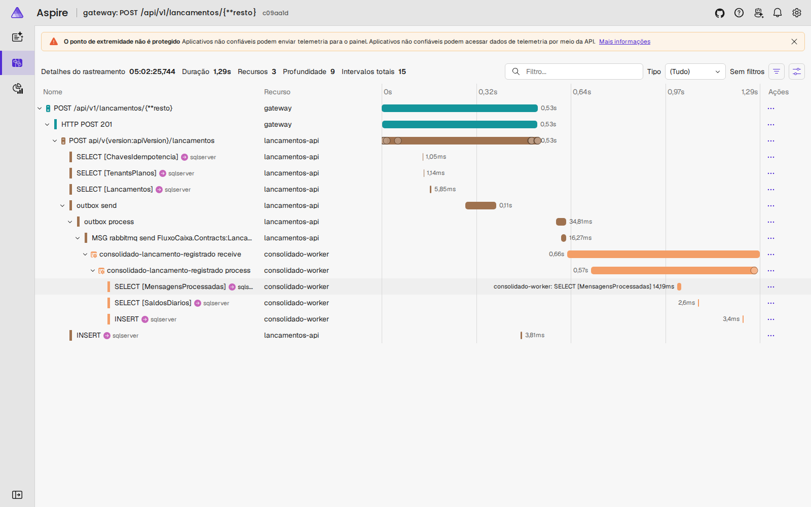

# Observabilidade

Os seis processos .NET (gateway, Lançamentos, Tenants, Consolidado.Api ×2 e Consolidado.Worker) exportam **traces, métricas e logs** com OpenTelemetry via OTLP ([ADR-0011](adr/0011-observabilidade-opentelemetry.md)). Localmente, o destino é o **Aspire Dashboard** do compose: http://localhost:18888. Em produção, basta trocar `OTEL_EXPORTER_OTLP_ENDPOINT` para um coletor ou para o Azure Monitor; o código não muda.

## Como está montado

- **Configuração comum:** `AddObservabilidade` (`FluxoCaixa.Infrastructure.Common/Telemetria`) é chamado no `Program.cs` de cada serviço, com o nome do serviço e os medidores de negócio dele.
- **Recurso:**
  - `service.name`: `gateway`, `lancamentos-api`, `tenants-api`, `consolidado-api`, `consolidado-worker`;
  - `service.instance.id`: nome do container, o que separa as duas réplicas do Consolidado;
  - `deployment.environment.name`.
- **Exportação:** só é ligada quando `OTEL_EXPORTER_OTLP_ENDPOINT` está definido. Por isso os testes e o `dotnet run` sem coletor não geram erros de conexão.

| Sinal | Origem |
|---|---|
| **Traces** | ASP.NET Core (sem `/health`), HttpClient (sem sondas `/health`), SqlClient (todas as consultas do EF Core), MassTransit (publish, outbox, send, receive, consume — o `traceparent` viaja no cabeçalho da mensagem) |
| **Métricas** | Runtime .NET, ASP.NET Core/Kestrel, HttpClient, MassTransit (consumo, entrega, outbox) e os medidores de negócio abaixo |
| **Logs** | `ILogger` exportado via OTLP, com `TraceId`/`SpanId`, escopos e mensagem formatada |

### Tenant na telemetria

- **Spans e logs:** carregam `tenant.id`.
  - Requisições HTTP: marcado pelo `TenantResolutionMiddleware`.
  - Consumo de eventos: marcado pelo `TenantConsumeFilter`.
  - Assim dá para filtrar no Aspire o que aconteceu com um cliente.
- **Métricas:** **não** levam o tenant. Com milhares de tenants, cada um viraria uma série temporal (explosão de cardinalidade). As métricas usam o **plano** como dimensão.

### Amostragem

Um trace só começa numa **operação de entrada**: requisição recebida (`Server`), mensagem consumida (`Consumer`) ou publicada (`Producer`). Dentro de um trace, tudo é gravado.

Atividade de fundo sem pai não gera trace. São casos como a varredura do outbox e do inbox do MassTransit no SQL (a cada segundo, em cada serviço) e as sondas de health check do gateway (a cada 2 s). Sem essa regra, elas eram a maioria dos traces no painel.

Em produção, o próximo passo é uma amostragem por proporção (ex.: 10%), mantendo 100% dos traces com erro via *tail sampling* no coletor.

## Métricas de negócio

| Medidor / instrumento | Tipo | Atributos | Para quê |
|---|---|---|---|
| `FluxoCaixa.Lancamentos` / `lancamentos.registrados` | contador | `tipo` (credito/debito), `origem` (registro/estorno) | Volume de negócio; reenvios idempotentes não contam |
| `FluxoCaixa.Lancamentos` / `lancamentos.quota_excedida` | contador | `plano` | Registros recusados pela quota (RN-09): sinal de upgrade |
| `FluxoCaixa.Consolidado` / `consolidado.atraso` | histograma (s) | — | Tempo entre o lançamento e o saldo gravado: **mede o SLO-07 (< 5 s) em produção** |
| `FluxoCaixa.Consolidado` / `consolidado.eventos` | contador | `resultado` (aplicado/duplicado) | Entregas repetidas descartadas pela inbox |
| `FluxoCaixa.Consolidado` / `consolidado.cache.leituras` | contador | `resultado` (acerto/falta/indisponivel) | Taxa de acerto do cache e Redis fora do ar (disjuntor aberto) |
| `FluxoCaixa.Consolidado` / `consolidado.retentativas` | contador | — | Eventos reprocessados pelo retry: contenção ou falha de infraestrutura (deve ficar em zero) |
| `FluxoCaixa.Gateway` / `gateway.limite_excedido` | contador | `limite` (tenant/ip), `plano` | 429 por plano: evidência do noisy neighbor (SLO-10) |

As métricas usam a API do .NET (`System.Diagnostics.Metrics` com `IMeterFactory`): as camadas Application não dependem do OpenTelemetry, e os testes unitários verificam as medições com `MetricCollector`.

## Passo a passo: seguir um lançamento

1. Suba a stack (`docker compose up -d` em `deploy/`) e registre um lançamento pela SPA (http://localhost:4200) ou pela API.
2. Abra http://localhost:18888 → **Rastreamentos** e clique em `gateway: POST /api/v1/lancamentos/{**resto}`.
3. O trace mostra o caminho inteiro, atravessando o RabbitMQ:

| Trecho | O que aparece |
|---|---|
| `gateway` | Requisição recebida e encaminhada (HTTP POST 201) |
| `lancamentos-api` | Consultas de idempotência, plano e quota; `outbox send`; `INSERT` do lançamento e do evento na mesma transação |
| `lancamentos-api` → RabbitMQ | `outbox process` → `rabbitmq send` (entrega do outbox, depois do commit) |
| `consolidado-worker` | `receive` → `process` → inbox (`MensagensProcessadas`), saldo (`SaldosDiarios`) e `INSERT`/`UPDATE` |

4. Em **Logs estruturados**, filtre por `tenant.id` ou abra os logs de um trace. Em **Métricas**, escolha o recurso (ex.: `consolidado-worker`) e o instrumento (ex.: `consolidado.atraso`).

## Alertas propostos (produção)

Com as métricas acima, no backend de produção (Azure Monitor/Grafana):

| Alerta | Condição |
|---|---|
| Atraso da consolidação | `consolidado.atraso` p95 > 5 s por 5 min (SLO-07) |
| Erros HTTP | `http.server.request.duration` com status 5xx > 1% por 5 min |
| Latência do Consolidado | p95 de `http.server.request.duration` no `consolidado-api` > 200 ms (SLO-05) |
| Redis fora | `consolidado.cache.leituras{resultado=indisponivel}` > 0 por 5 min |
| Mensagens com falha | `messaging.masstransit.consume.errors` > 0 (antes de irem para a DLQ) |
| Noisy neighbor | `gateway.limite_excedido` alto e contínuo para o mesmo plano (candidato a upgrade) |

Profundidade das filas e da DLQ vem do RabbitMQ (plugin Prometheus em produção; UI de management localmente), não da aplicação.
