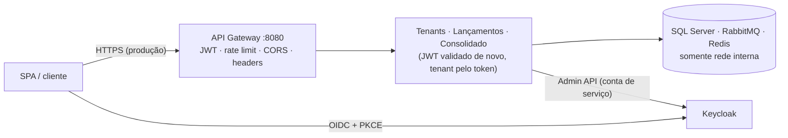

# Segurança

Ameaças consideradas, controles implementados, como cada controle foi verificado e o que fica como risco residual. Requisitos de origem: SEG-01 a SEG-09 em [requisitos não funcionais](requisitos-nao-funcionais.md#7-segurança-requisitos). Decisões relacionadas: [ADR-0008](adr/0008-autenticacao-keycloak-oidc-jwt.md) (identidade), [ADR-0009](adr/0009-api-gateway-yarp.md) (gateway), [ADR-0015](adr/0015-multi-tenancy-banco-compartilhado.md) (isolamento entre tenants).

## 1. Superfície exposta

| Ponto de entrada | Autenticação | Limite |
|---|---|---|
| `POST /api/v1/tenants` (cadastro) | Pública | 10 req/min por IP |
| `GET /api/v1/planos` | Pública | 120 req/min por IP |
| Demais rotas `/api/v1/**` | JWT do Keycloak (gateway **e** serviço) | Token bucket por tenant: Free 20 req/s, Pro 100 req/s |
| Keycloak (login) | Usuário e senha (política e bloqueio por força bruta do realm) | Do próprio Keycloak |

## 2. Ameaças (STRIDE resumido) e controles

| Ameaça | Exemplo no domínio | Controles implementados |
|---|---|---|
| **S**poofing (falsificação de identidade) | Token forjado ou de outro emissor | JWT assinado (RS256) validado no gateway e em cada serviço: assinatura (JWKS), `iss`, `aud=fluxo-caixa-api`, `exp`. Login OIDC com Authorization Code + **PKCE**, sem segredo no navegador. `MapInboundClaims=false` para ler as claims exatamente como emitidas. |
| **T**ampering (adulteração) | Alterar valor ou tenant de um lançamento | Lançamentos **imutáveis** (correção só por estorno — ADR-0014); `TenantId` nunca vem do corpo; interceptor do EF bloqueia gravação de dados de outro tenant; acesso a dados só por EF Core (consultas parametrizadas); TLS na borda em produção. |
| **R**epudiation (repúdio) | "Não fui eu que estornei" | `CriadoPor` (claim `sub`) em cada lançamento e estorno; histórico imutável; logs estruturados com `TraceId`. |
| **I**nformation disclosure (vazamento) | Um comerciante ver o caixa de outro | Isolamento em profundidade (ADR-0015): filtro global por `TenantId`, chaves de cache prefixadas pelo tenant, **404** para recurso de outro tenant, testes de isolamento obrigatórios. Respostas de erro em ProblemDetails sem stack trace; header `Server` removido; tokens e senhas fora de logs e de `ToString()` (RP-03, SEG-07). |
| **D**enial of service (negação de serviço) | Um tenant ou um script derrubando a plataforma | Rate limiting **por tenant** (vizinho barulhento não afeta os demais) e **por IP** nas rotas públicas; limite de 1 MB no corpo (413); timeouts por cluster no gateway; disjuntor do cache; filas duráveis absorvendo picos de escrita. |
| **E**levation of privilege (elevação de privilégio) | Operador estornar; usuário trocar o próprio tenant | Políticas por papel (`admin`, `operador`) no controller **e** no caso de uso; fallback de autorização exige usuário autenticado; atributos `tenant_id`/`plano` do usuário **editáveis só por administradores do realm** (o usuário não consegue trocar de tenant pelo console de conta); conta de serviço do Tenants.Api restrita a gerenciar usuários e organizações. |

## 3. Endurecimento HTTP no gateway

| Controle | Valor |
|---|---|
| `X-Content-Type-Options` | `nosniff` |
| `X-Frame-Options` | `DENY` |
| `Content-Security-Policy` | `default-src 'none'; frame-ancestors 'none'` (respostas são JSON) |
| `Referrer-Policy` | `no-referrer` |
| `Permissions-Policy` | câmera, microfone e geolocalização desativados |
| `Server` | removido |
| HSTS | ativo fora de desenvolvimento |
| CORS | somente a origem da SPA (`http://localhost:4200` localmente); cabeçalhos `Authorization`, `Content-Type`, `Idempotency-Key` |
| Corpo da requisição | máximo 1 MB (413 antes de encaminhar) |

### SPA (nginx)

Detalhes em [ADR-0018](adr/0018-frontend-angular-spa.md).

| Controle | Valor |
|---|---|
| Autenticação | Authorization Code + **PKCE** com client público: nenhum segredo nem senha passa pela SPA |
| Envio do token | O Bearer só é anexado às URLs do gateway (`secureRoutes`) |
| `Content-Security-Policy` | `script-src 'self'` (sem scripts inline); `connect-src` limitado ao gateway e ao Keycloak; `frame-ancestors 'none'`; `object-src 'none'`; `base-uri 'self'`. As origens vêm das variáveis de ambiente |
| Demais cabeçalhos | `nosniff`, `X-Frame-Options: DENY`, `Referrer-Policy: no-referrer`, `Permissions-Policy`, `Cross-Origin-Opener-Policy` |
| Fontes e ícones | Servidos pela própria aplicação (sem CDN de terceiros) |
| Container | nginx sem privilégios (usuário 101), `server_tokens off` |

## 4. Como os controles foram verificados

| Controle | Evidência |
|---|---|
| JWT (sem token, assinatura inválida, expirado → 401; token não chega ao serviço) | `FluxoCaixa.Gateway.Tests` |
| Rotas públicas × protegidas | `FluxoCaixa.Gateway.Tests` |
| Rate limit por tenant sem afetar outro tenant (SLO-10) | `FluxoCaixa.Gateway.Tests` e compose: rajada de 60 requisições — Padaria (Free) 20×200 e 40×429; Mercado (Pro) 60×200 |
| Rate limit do cadastro por IP | `FluxoCaixa.Gateway.Tests` |
| Headers de segurança, CORS, 413 | `FluxoCaixa.Gateway.Tests` e compose |
| Isolamento entre tenants (404, listagem, estorno, consolidado, cache) | `Lancamentos.IntegrationTests`, `Consolidado.IntegrationTests`, `FluxoCaixa.Infrastructure.Common.UnitTests` |
| Papéis (operador não estorna nem troca plano) | Testes de integração de Lançamentos e Tenants |
| Claims corretas no token real do Keycloak | `Tenants.IntegrationTests` (Keycloak real) |
| CSP da SPA não quebra o login OIDC nem as chamadas à API | Smoke E2E (Playwright) contra a imagem de produção |
| Operador não vê estorno nem "Minha empresa" | Testes unitários da SPA (`adminGuard`, página de lançamentos) |

## 5. Riscos residuais e evolução

| Risco / lacuna | Situação local | Produção / evolução |
|---|---|---|
| Tráfego sem TLS | HTTP no compose | TLS na borda (Azure Front Door/WAF) e entre serviços (mTLS em service mesh) |
| Aplicações usando o login `sa` | Simplificação local | Um login por serviço com permissões mínimas, ou Managed Identity no Azure SQL |
| Portas de depuração dos serviços expostas (5101, 5201, 5202, 5301) | Conveniência de desenvolvimento | Somente o gateway exposto; serviços em rede privada |
| APIs confiam em `X-Forwarded-*` de qualquer origem | Seguro porque os serviços só são alcançáveis pela rede interna | Restringir `KnownNetworks` à sub-rede do gateway |
| Rate limit por IP atrás de um proxy de borda | O IP é o da conexão | Habilitar `ForwardedHeaders` no gateway com a lista de proxies confiáveis |
| Limite por usuário dentro do tenant | Não implementado (tenant + IP bastam para o RNF-04) | Encadear um limitador por `sub` |
| Client `fluxo-caixa-testes` (password grant) | Só no realm local | Removido do realm de produção |
| Segredos em `deploy/.env` | Arquivo local, fora do Git | Azure Key Vault + Managed Identity |
| Consultas SQL fora do EF (ex.: relatórios futuros) escapariam do filtro de tenant | Não há hoje | Row-Level Security com `SESSION_CONTEXT('TenantId')` |
| Varredura automatizada | Não há | SAST/DAST, varredura de dependências e de imagens no pipeline (Fase 9 / evolução) |
| MFA | Não exigido | MFA obrigatório para o papel `admin` (política do Keycloak) |
| Tokens no `sessionStorage` da SPA | Mitigado por CSP estrita e tokens de vida curta | BFF com tokens só no servidor, se o perfil de risco exigir |
| `style-src 'unsafe-inline'` na SPA | Exigido pelos estilos de componentes do Angular | Nonce de CSP (`ngCspNonce`) |
